# DaveTV Web E2E Proof

Playwright writes publishable proof screenshots here. These are real browser
captures against the DaveTV UI, not design mockups or mocked layouts.

Run:

```bash
cd tests/playwright
npm run proof
```

## Website Picks

Use these first on the GitHub website/project page. They are current
Playwright captures from the Samsung QN85 mock viewport and cover the surfaces
Dave keeps checking: main app, View picker, settings, voice, side panels, and
playback.

| Surface | Screenshot |
| --- | --- |
| Main DaveTV interface | 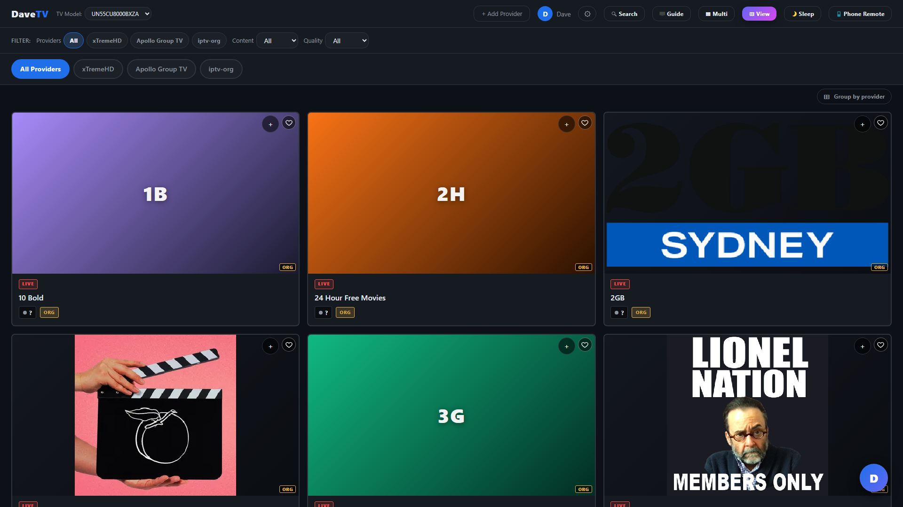 |
| Search overlay | 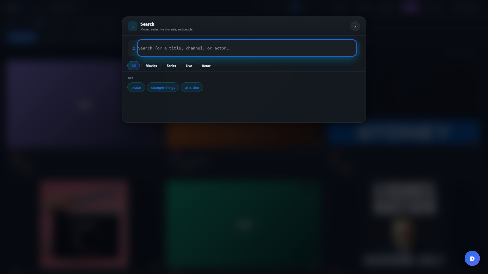 |
| TV guide | 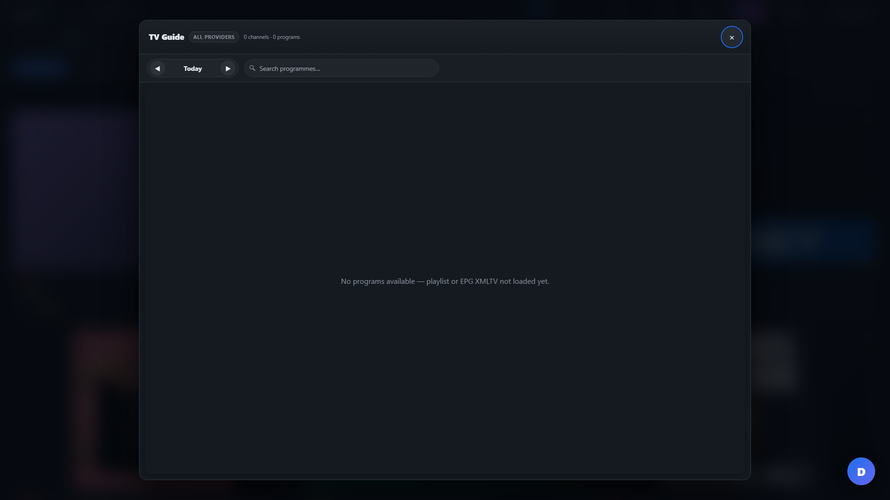 |
| Settings - Providers | 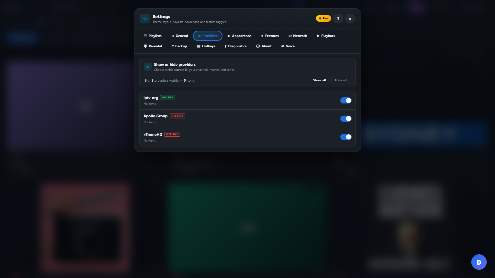 |
| Settings - Voice | 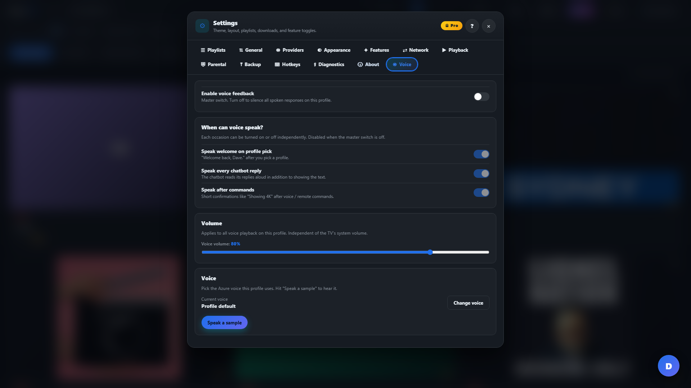 |
| Choose Your View | 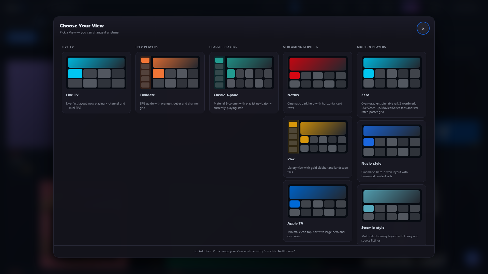 |
| Zero style side panel | 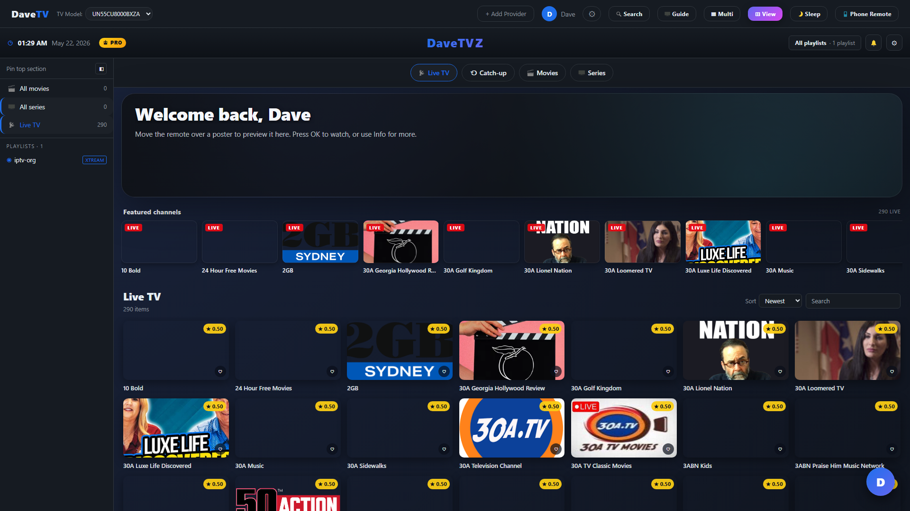 |
| TiviMate style bottom nav | 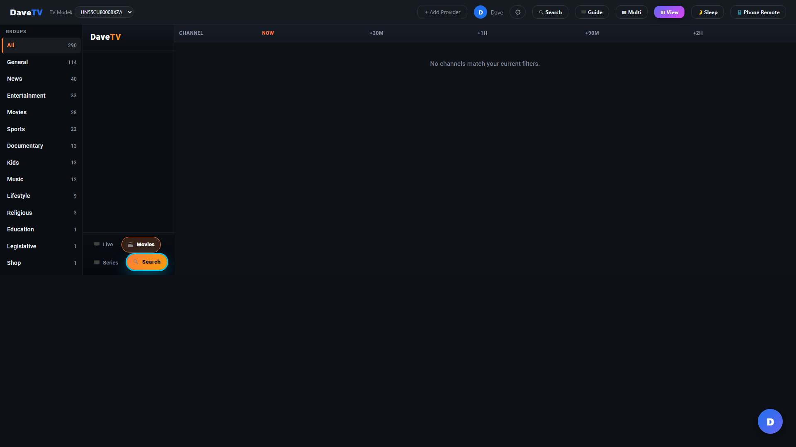 |
| Classic three-pane rail | 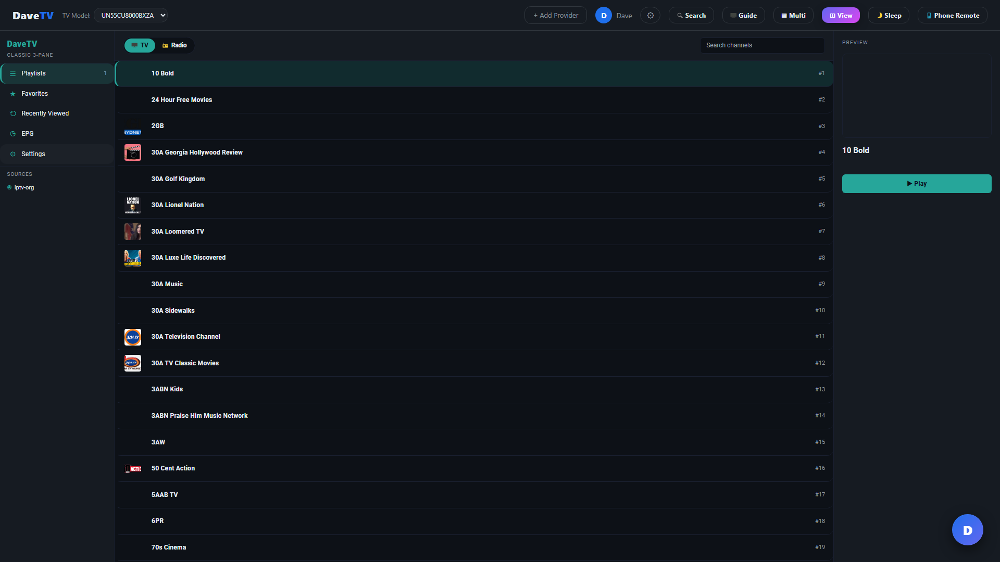 |
| Mom Mode tabs | 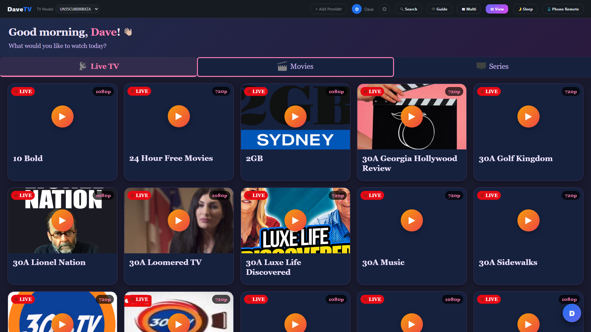 |
| Playback proof/recovery state | 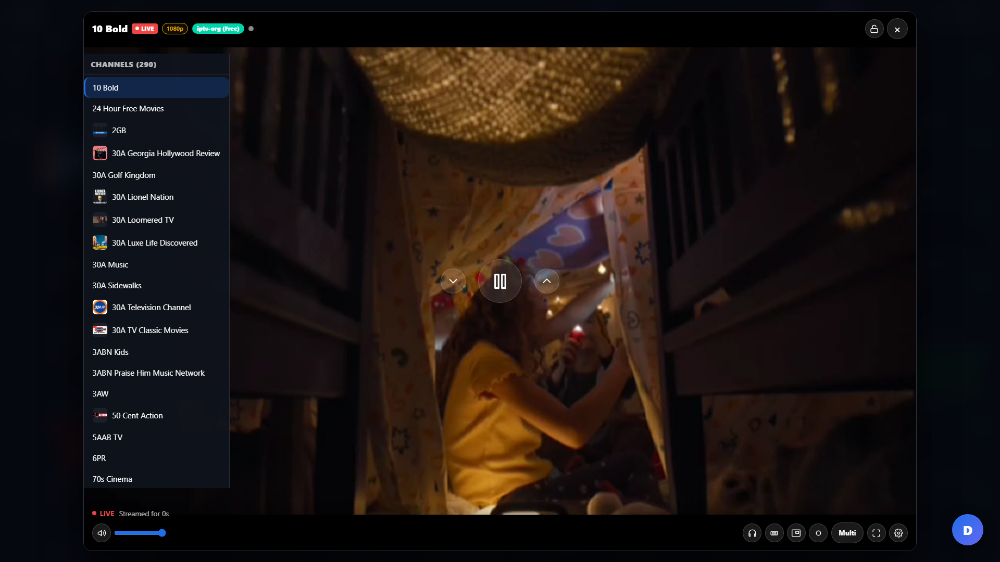 |

## Legacy Captures

These older images remain for comparison until the website is updated:

| Surface | Screenshot |
| --- | --- |
| Authenticated DaveTV shell |  |
| Home interface | 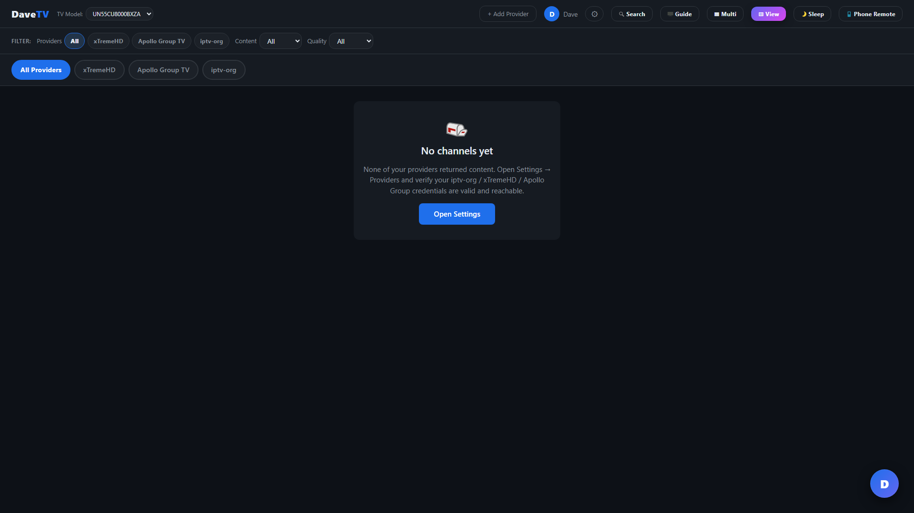 |
| Settings - General | 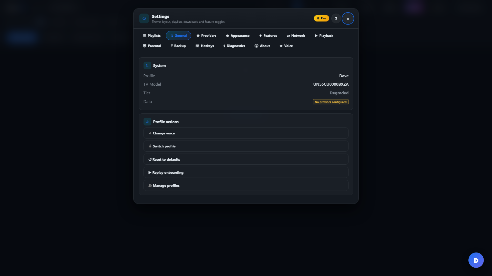 |
| Settings - Playlists | 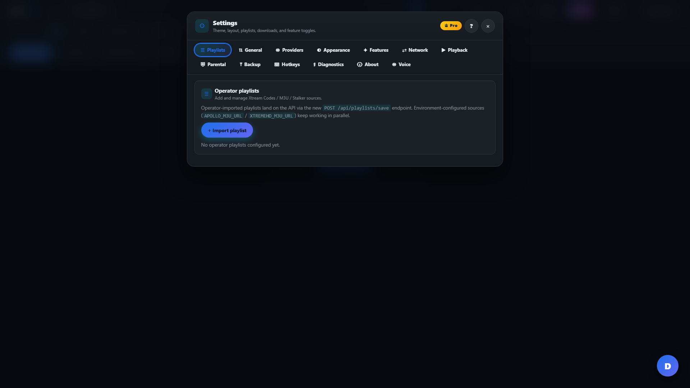 |
| Settings - Providers | 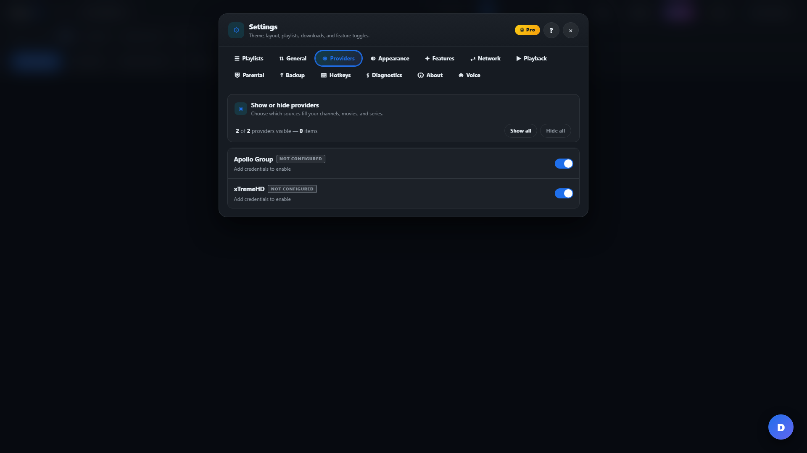 |
| Settings - Voice | 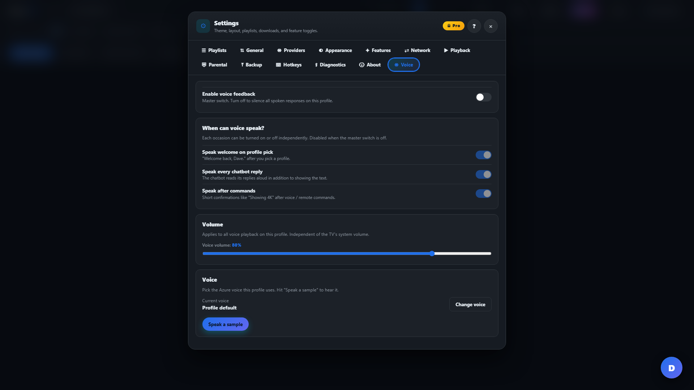 |
| Azure voice picker | 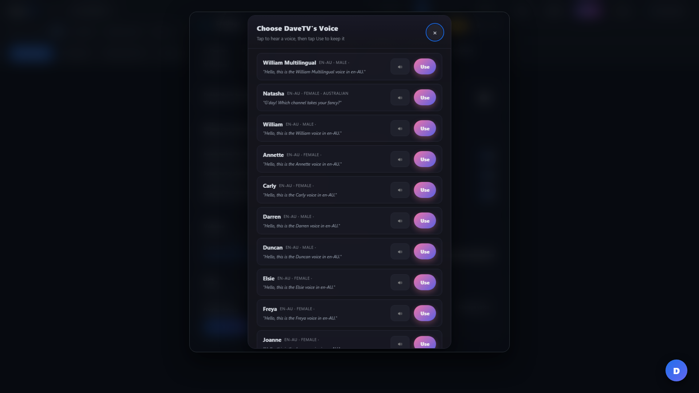 |
| View picker thumbnails | 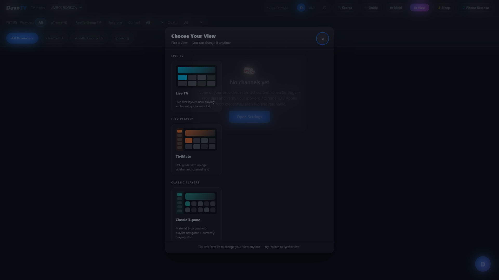 |

For local auth-required testing, start the API with a local-only Dave admin and
set:

```bash
DAVETV_E2E_ALLOW_ACCOUNT_SETUP=true
DAVETV_E2E_ADMIN_EMAIL=<local admin email>
DAVETV_E2E_ADMIN_PASSWORD=<local admin password>
DAVETV_E2E_EMAIL=playwright-dave@example.test
DAVETV_E2E_PASSWORD=<local test password>
```

Do not commit `tests/playwright/.auth/`; it contains the browser session cookie.
