# 00 - Reference Apps Architecture Overview

Generated: 2026-05-20
Agent: 01 of 20 (DaveTV reference-extraction swarm)

## Contract Banner

This is a REFERENCE document. It maps the architecture of five external IPTV
apps stored read-only under `G:\Github\IPTV-Apps\`. No source has been copied
into HermesTV from this analysis.

Binding contracts that still apply to any work derived from this map:

- `docs/46_PROVIDER_TRUTH_PROOF_CONTRACT.md` - truth-gate proof is still
  required before any provider feature claim. Reference adoption does not bypass
  proof gates.
- `docs/47_REMAINING_E2E_COMPLETION_CONTRACT.md` - the whole config -> registry
  -> upstream -> normalize -> UI -> ticket chain must hold.
- `docs/48_REFERENCE_APPS_E2E_ADOPTION_CONTRACT.md` - and especially the
  License Boundary section: iptvnator is MIT, Extreme-InfiniTV is GPL-3.0-or-later,
  ynotv is AGPL-3.0, NuvioWeb has no settled license, iptv-org/iptv is CC0/MIT
  for tools. Patterns can be ported. Source code may NOT be pasted from GPL or
  AGPL projects into HermesTV without explicit license acceptance.

## App 1 - iptvnator

- License: MIT (`G:\Github\IPTV-Apps\iptvnator\LICENSE.md`). Lowest-friction
  reference for code-shaped adoption.
- Project type: Nx monorepo, Electron + Angular cross-platform desktop player
  with optional Docker/PWA build.
- Top-level layout:
  - `apps/electron-backend/` - Electron main process, SQLite (Drizzle) schema,
    operations, IPC events for playlists, EPG, downloads, favorites, Xtream.
  - `apps/web/`, `apps/web-backend/` - PWA + lightweight Node backend.
  - `apps/xtream-mock-server/` - the fixture provider HermesTV needs to clone in
    behavior (account info, live/VOD/series, EPG, scenarios). Cited by
    contract 48 P0.1.
  - `apps/stalker-mock-server/` - Stalker/Ministra fixture, parallel pattern.
  - `apps/website/`, `apps/remote-control-web/` - marketing site and TV-remote
    web UI for casting key events.
  - `libs/playlist/`, `libs/portal/`, `libs/epg/`, `libs/services/`,
    `libs/shared/`, `libs/ui/`, `libs/workspace/`, `libs/m3u-state/` - Nx libs
    split by concern.
- Provider layer: `libs/portal/xtream/data-access`,
  `libs/portal/stalker/data-access`, `libs/portal/catalog/feature`.
- Catalog layer: SQLite via `apps/electron-backend/src/app/database/` with
  `content.operations.ts`, `category.operations.ts`, `xtream.operations.ts`.
- EPG layer: `libs/epg/data-access/src/lib`.
- Player layer: `libs/ui/playback/` plus Electron-side embedded MPV under
  `apps/electron-backend/native/` and `tools/embedded-mpv/`.
- UI shell: Angular components in `libs/ui/components/`, layouts in
  `apps/electron-backend/src/app/`.
- Biggest pattern HermesTV should adopt: the Xtream mock server scenarios model
  (`apps/xtream-mock-server/src/app/scenarios.ts` + `routes/dispatch.ts`) - a
  deterministic local Xtream server with bad-creds, empty-catalog, degraded,
  and happy-path scenarios. Required by contract 48 P0.1 + P0.2.

## App 2 - Extreme-InfiniTV

- License: GPL-3.0-or-later (`G:\Github\IPTV-Apps\Extreme-InfiniTV\LICENSE`).
  Pattern-only adoption. Tests and behavior can be ported; source paste is not
  permitted.
- Project type: Astro 6 + Svelte 5 web app with a Tauri 2 desktop wrapper, MPV
  embedded for native playback, TMDB/TVMaze enrichment.
- Top-level layout:
  - `src/components/` - Svelte/Astro UI (Hub strips, EPG, search, sort menus,
    favorites, watchlist, sidebar).
  - `src/scripts/lib/` - the bulk of the application logic: catalog, EPG,
    streaming diagnostics, stream headers, playlist health, preferences,
    account info, downloads, M3U parser, Xtream client.
  - `src/scripts/{epg,movies,series,stream,settings}/` - feature-level
    orchestration scripts.
  - `src/pages/`, `src/layouts/` - Astro routes/layouts.
  - `src-tauri/src/` - Rust backend: `mpv_windows.rs`, `mpv_macos.rs`,
    `mpv_popout.rs`, `mpv_secondary.rs`, `sync_provider.rs`, `dvr/`,
    `epg_streaming.rs`, `tmdb_cache.rs`, `tvmaze.rs`, `db_bulk_ops.rs`.
  - `tests/` - vitest fixtures for `m3u-parser.test.ts`, `epg-data.test.ts`,
    `player-runtime.test.ts` - the canonical M3U and EPG behavior tests cited
    by contract 48 P0.4.
- Provider layer: `src/scripts/lib/account-info.js`,
  `src/scripts/lib/creds.js`, `src/scripts/lib/catalog.js`.
- Catalog layer: `src/scripts/lib/catalog.js` + Rust bulk ops in
  `src-tauri/src/db_bulk_ops.rs`.
- EPG layer: `src/scripts/lib/epg-data.js`, `src/scripts/lib/epg-worker.ts`,
  `src/scripts/epg/{epg,mapping}.ts`, `src-tauri/src/epg_streaming.rs`.
- Player layer: `src/scripts/stream/stream.ts`,
  `src/scripts/lib/stream-diagnostic.js`,
  `src/scripts/lib/stream-headers.ts`,
  `src/scripts/lib/playlist-health.ts`, plus `src-tauri/src/mpv_*.rs`.
- UI shell: Astro pages + Svelte islands; spatial navigation in
  `src/scripts/spatial-navigation.js`.
- Biggest pattern HermesTV should adopt: the realistic M3U parser test
  matrix (BOM/CRLF, `#EXTGRP`, `#EXTVLCOPT`, catchup attrs, `tvg-chno`, radio
  markers, escaped quotes) plus stream diagnostic verdicts (HEAD fallback,
  Range 0-0, MIME check). Required by contract 48 P0.4.

## App 3 - ynotv

- License: AGPL-3.0 (`G:\Github\IPTV-Apps\ynotv\LICENSE`). Architecture
  reference only. No source paste, even server-side.
- Project type: pnpm workspace, Tauri 2 + React 19 + TypeScript IPTV player
  for Windows with embedded MPV.
- Top-level layout:
  - `packages/app/src/` - React UI entry (`App.tsx`, `main.tsx`).
  - `packages/app/src-tauri/` - Rust Tauri backend, `Cargo.toml`,
    `tauri.conf.json`, capabilities, build script.
  - `packages/app/scripts/` - build/screenshot tooling.
  - `pnpm-workspace.yaml` - workspace definition.
  - Contract 48 cites `packages/core/src/{types,interfaces}.ts` and
    `packages/ui/src/services/{epg-streaming,failover-groups,stream-resolver}.ts`
    but the local checkout collapses everything under `packages/app/`. Treat
    those paths as conceptual modules to look for inside `packages/app/`.
- Provider layer: provider/source typing intended for `packages/core` -
  use the contract 48 path as the conceptual reference.
- Catalog layer: same conceptual `packages/core` location plus the React
  client store.
- EPG layer: `packages/ui/src/services/epg-streaming.ts` (conceptual).
- Player layer: `packages/ui/src/services/stream-resolver.ts` plus the Tauri
  MPV plugin (Windows-only).
- UI shell: React under `packages/app/src/`.
- Biggest pattern HermesTV should adopt: failover groups + stream resolver
  contract (`failover-groups.ts`, `stream-resolver.ts`) - per-channel backup
  URLs, ordered failover, auto-detect of stalled streams. Aligns with the
  contract 48 P1.7 failover requirement.

## App 4 - NuvioWeb

- License: Not stated in README (`G:\Github\IPTV-Apps\NuvioWeb\README.md`).
  Treat as wrapper/build pattern reference only. Per contract 48, do not paste
  source.
- Project type: Vanilla JS web app plus thin Tizen and webOS service wrappers,
  Stremio-addon-driven catalog.
- Top-level layout:
  - `js/` - app code: `bootstrap/`, `core/`, `data/`, `domain/`, `i18n/`,
    `platform/`, `runtime/`, `ui/`, plus `app.js` and `config.js`.
  - `js/core/{addons,auth,network,player,profile,qr,storage,tmdb}` - feature
    modules.
  - `js/domain/{model,repository}` - clean separation of data shape vs storage.
  - `js/platform/{adapters,webos}` - platform-specific adapters, browser/web
    indirection in `environment.js`.
  - `scripts/` - `build.mjs`, `serve.mjs`, `sync-wrapper.mjs`,
    `sync-tizenbrew.mjs`, `package-webos.mjs`, ares-* webOS tooling.
  - `services/com.nuvio.tizen.service/` and `services/com.nuvio.lg.service/` -
    native service stubs for Tizen and webOS, each with their own `package.json`
    and `src/`.
- Provider layer: `js/core/addons/` (Stremio addon ecosystem).
- Catalog layer: `js/domain/{model,repository}`.
- EPG layer: not first-class - Stremio addons surface their own metadata.
- Player layer: `js/core/player/`.
- UI shell: `js/ui/` plus root `index.html` and `css/`.
- Biggest pattern HermesTV should adopt: one shared web app plus thin
  Tizen/webOS wrappers driven by `scripts/sync-wrapper.mjs` and
  `scripts/sync-tizenbrew.mjs`. Mirrors HermesTV's web-and-Tizen mirror need
  (docs `27_WEB_AND_TIZEN_MIRROR.md`).

## App 5 - iptv (iptv-org/iptv)

- License: CC0 for data, MIT-style for tooling
  (`G:\Github\IPTV-Apps\iptv\LICENSE` is Unlicense-equivalent public domain).
  Safe to consume as data.
- Project type: Curated repository of public M3U playlists plus TypeScript
  tooling that builds and validates them.
- Top-level layout:
  - `streams/` - per-country M3U files (`us.m3u`, `uk.m3u`, etc., plus
    operator slices like `*_pluto.m3u`, `*_samsung.m3u`).
  - `scripts/` - TS pipeline: `api.ts`, `commands/`, `core/`, `generators/`,
    `models/`, `tables/`, `utils.ts`.
  - `tests/` - generator + validator tests.
  - `m3u-linter.json` - lint rules for the playlists.
- Provider layer: not an app - it IS the canonical M3U dataset.
- Catalog layer: streams files act as catalog source-of-truth for FAST
  legal channels.
- EPG layer: external reference to `iptv-org/epg` (not vendored here).
- Player layer: none.
- UI shell: none.
- Biggest pattern HermesTV should adopt: the country and operator playlist
  taxonomy as a legal FAST adapter source (contract 48 P2.2). HermesTV already
  uses iptv-org via `services/hermes-tv-api/src/lib/iptvOrg.js`.

## Common 5-Layer Architecture (Provider -> Catalog -> EPG -> Player -> UI Shell)

```mermaid
flowchart TB
  subgraph L1["Layer 1 - Provider Adapter"]
    P1["iptvnator: libs/portal/xtream + stalker (data-access)"]
    P2["Extreme-InfiniTV: scripts/lib/{account-info,catalog,creds}"]
    P3["ynotv: packages/core types + interfaces (conceptual)"]
    P4["NuvioWeb: js/core/addons (Stremio)"]
    P5["iptv-org: streams/*.m3u dataset"]
    H1["HermesTV: services/hermes-tv-api/src/lib/{providerRegistry,xtreamClient,m3uClient,iptvOrg,jellyfin}.js -- DONE shape, gaps in Stalker + failover"]
  end
  subgraph L2["Layer 2 - Catalog Normalizer"]
    C1["iptvnator: SQLite (Drizzle) operations"]
    C2["Extreme-InfiniTV: scripts/lib/catalog.js + Rust db_bulk_ops"]
    C3["ynotv: packages/core (conceptual)"]
    C4["NuvioWeb: js/domain/repository"]
    H2["HermesTV: catalogMerge.js + routes/catalog.js -- needs source-health registry tie-in"]
  end
  subgraph L3["Layer 3 - EPG Engine"]
    E1["iptvnator: libs/epg/data-access"]
    E2["Extreme-InfiniTV: scripts/epg + scripts/lib/epg-{data,worker}"]
    E3["ynotv: packages/ui/services/epg-streaming (conceptual)"]
    E5["iptv-org/epg (external)"]
    H3["HermesTV: lib/epgWaterfall.js + routes/epg.js + routes/epgGrid.js -- waterfall in, fuzzy ambiguity guard in, mock rows still in epgGrid"]
  end
  subgraph L4["Layer 4 - Player + Stream Resolver"]
    PL1["iptvnator: libs/ui/playback + embedded-mpv"]
    PL2["Extreme-InfiniTV: scripts/stream + Rust mpv_*"]
    PL3["ynotv: packages/ui/services/stream-resolver (conceptual)"]
    PL4["NuvioWeb: js/core/player"]
    H4["HermesTV: streamResolver.js + hlsProxy.js + streamProbe.js -- ticket path OK, failover groups missing"]
  end
  subgraph L5["Layer 5 - UI Shell"]
    U1["iptvnator: Angular libs/ui/components"]
    U2["Extreme-InfiniTV: Astro + Svelte src/components"]
    U3["ynotv: React packages/app/src"]
    U4["NuvioWeb: vanilla js/ui + Tizen/webOS service wrappers"]
    H5["HermesTV: apps/hermes-web-tv shells + Tizen wrapper -- QR onboarding now real, dynamic shell engine in"]
  end
  L1 --> L2 --> L3 --> L4 --> L5
```

## What HermesTV Already Adopted

These priorities from contract 48 are visible in-tree as of this map:

- Priority 1 - Xtream fixture: `services/hermes-tv-api/test/catalogProviders.test.js`
  and `tools/test-provider-e2e.js` exercise the IPTVnator scenarios pattern
  against `services/hermes-tv-api/src/lib/xtreamClient.js`.
- Priority 2 - M3U parser: parser hardening landed in
  `services/hermes-tv-api/src/lib/m3uClient.js` with the BOM/CRLF/EXTGRP/
  EXTVLCOPT/catchup/tvg-chno cases driven from the Extreme-InfiniTV test
  matrix (test coverage shows up in the same provider suite).
- Priority 3 - EPG waterfall + safe fuzzy: `services/hermes-tv-api/src/lib/epgWaterfall.js`
  plus `services/hermes-tv-api/src/routes/epg.js` and
  `services/hermes-tv-api/test/epgProviderSources.test.js`.

## What's Still Missing (forward pointers for the other 19 markdowns)

- Stalker/Ministra provider implementation (no current HermesTV equivalent).
- Provider account health surfacing (expiry, max connections, active
  connections, trial status) cited in contract 48 P1.1.
- Failover groups and per-channel backup URLs (ynotv pattern).
- Catchup/timeshift list + play paths (currently 501 in HermesTV).
- DVR + downloads byte pipelines (envelope-only today).
- VOD/series detail browse with seasons/episodes (Xtream/TMDB enrichment).
- Subtitle search/download and audio track picker.
- Spatial-navigation/D-pad parity for Tizen across provider, EPG, player,
  settings, and error screens.
- Tizen WGT inspect + AVPlay/ticket proof (contract 48 Tizen row).
- Mock-EPG removal from `routes/epgGrid.js` (still returns synthetic rows;
  blocks contract 48 EPG row).

Forward map: subsequent agents (02-20) will deep-dive each app's tests,
parsers, scenarios, stream diagnostics, player runtimes, and platform
wrappers into their own files in this directory.
