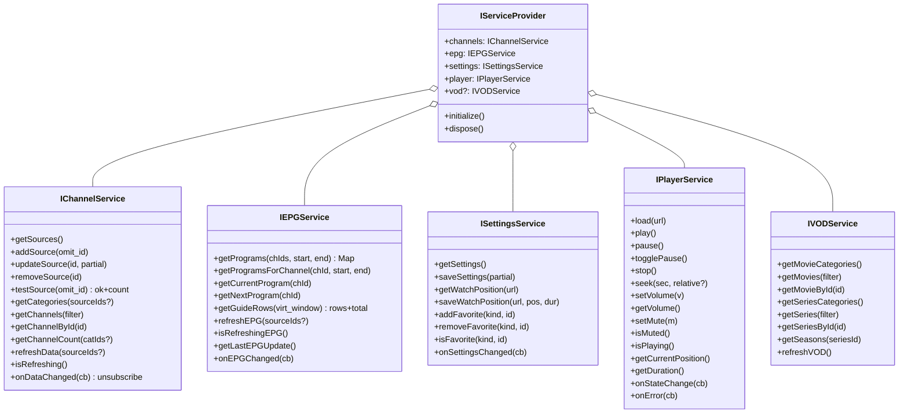
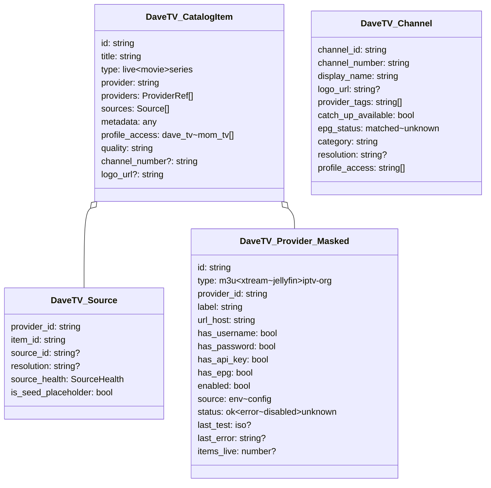

License: AGPL — pattern-only extraction. No source copying. See docs/reference-apps/LICENSE_ATTRIBUTION.md.

# ynoTV Core Type Contracts — Cross-Reference vs DaveTV

ynoTV is an AGPL Tauri + React + mpv IPTV player for Windows. It descends from sbtlTV and codifies its data contracts in a `@ynotv/core` package decoupled from any adapter, so the same shapes flow between an in-process M3U/Xtream/Stalker parser and a remote backend API.

Files audited (architecture only — no code reproduced): `packages/core/src/types.ts`, `packages/core/src/interfaces.ts`, `packages/core/src/index.ts` (3-line barrel), `packages/local-adapter/src/` (m3u-parser, xtream-client, stalker-client, xmltv-parser — confirm the shapes work end-to-end), `README.md`, `LICENSE` (AGPL v3).

---

## 1 — Domain entities (paraphrased)

### Source — the provider connection
Discriminated by `type` ∈ {`xtream`, `m3u`, `stalker`, `epg`}. Refined subtypes: `XtreamSource` (requires `username`/`password`), `M3USource`, `EPGSource`. Carries:

- identity: `id`, `name`, `enabled`, `display_order`
- connection: `url`, type-specific creds (`username`/`password`/`mac`)
- EPG wiring: `epg_url` override, `auto_load_epg`, `additional_epg_urls[]` waterfall fill, `epg_timeshift_hours`, `advanced_epg_matching`
- failover: `backup_macs[]`, `backup_credentials[]` (xtream user/pass tuples), `backup_urls[]`
- ingest tuning: `vod_only`, `user_agent`

Two decisions stand out: failover is a first-class field on the source itself, and one Source can supply EPG for OTHER sources via `additional_epg_urls` — the explicit waterfall pattern DaveTV partially mirrors in `epgWaterfall.js`.

### Category, Channel, Program, GuideRow
- `Category`: `category_id`, `category_name`, `source_id` back-pointer, optional `parent_id`. Single join key, not duplicated on channels.
- `Channel`: `stream_id` PK, `name`, `stream_icon`, `source_id`, `epg_channel_id` (the tvg-id, separate from PK so it can cross sources), `category_ids[]` (array — one channel, many categories), `direct_url` baked in at parse time, `tv_archive` (boolean OR numeric hours), `is_adult`, `channel_num` AND `provider_order` (two distinct ordering keys — provider-advertised tvg-chno plus position-in-M3U so operator order survives).
- `Program`: `channel_id` (joins to `Channel.epg_channel_id`), `title`, `start`/`stop` as native `Date`, `desc`, optional `id`/`source_id`, plus pre-computed `left_pct` and `width_pct` render hints.
- `GuideRow`: `{ channel, programs[], index }` — paired and indexed for virtual scroll, not separate channel-then-programs round trips.

### VOD entities
- `Movie`: stream PK, clean `title` plus parsed `year`, `tmdb_id`, plot/cast/director/genre/release_date/duration/rating, `direct_url`
- `Series`: **`series_id` PK (NOT `stream_id`)** and `cover` — the type refuses to play a series object
- `Season`: `season_number` + `episodes[]`
- `Episode`: `id`, `title`, `episode_num`, `season_num`, `direct_url`, optional metadata

### Settings + state
- `UserSettings`: `sources[]`, `selected_categories[]`, `volume`, `muted`, `preferred_stream_type` ∈ {ts, m3u8, auto}, `hardware_decoding`, `guide_hours_visible`, `theme` ∈ {dark, light, system}, `watch_positions` keyed by URL, `favorites` partitioned by channels/movies/series
- `WatchPosition`: position/duration/updated_at
- `AppState`: separates persistent data, runtime UI state, and loading flags

### Sports + ConnectionMode
Sports types (Event/Team/League/Match/BroadcastChannel) reference channels by display data, not FK — because TVMaze-style feeds don't know operator stream_ids. `ConnectionMode = 'standalone' | 'server'` plus `ServerConnection { url, username, token? }` switches between local adapter and remote API.

---

## 2 — Service interface contracts (the bigger lesson)

The five `I*Service` interfaces are the actual architecture. They split a player's data layer along clean seams that DaveTV's Express routes only partially match:

Three decisions stand out: (1) `getGuideRows({ startIndex, count, categoryIds?, timeOffsetHours?, hoursToShow? })` is a virtual-scroll-aware query returning pre-packed `{ rows, total }` — DaveTV's `epgGrid.js` batches but isn't a typed contract; (2) `testSource()` returning `{ success, error?, channelCount? }` makes provider-probe a first-class operation — DaveTV's `providerStore.recordTest` records but the test path is implicit; (3) every service exposes `onDataChanged(cb) → unsubscribe` event hooks — DaveTV is pure request-response and live updates ride on client polling.

---

## 3 — DaveTV cross-reference

DaveTV models the same domain across `services/hermes-tv-api/src/`:

- `routes/catalog.js`: merged `catalog[]` items shaped `{ id, title, type, provider, providers[], sources[], metadata, profile_access, quality, ... }` keyed by `type` ∈ {`live`, `movie`, `series`}. Quality prefs in `_meta.quality_preference`.
- `routes/channels.js`: TV-safe channel shape `{ channel_id, channel_number, display_name, logo_url, provider_tags[], catch_up_available, epg_status, category, resolution, profile_access[] }` — explicitly strips stream URLs and credentials per its SECURITY CONTRACT.
- `lib/catalogMerge.js`: collapses live channels by normalised title into `{ ...primary, sources, providers }` where `Source` = `{ provider_id, item_id, source_id, resolution, source_health, is_seed_placeholder }`. Provider priority hard-coded (xtremehd > apollo > iptv-org > jellyfin > seed) plus wave-15 unhealthy-provider penalty.
- `lib/providerRegistry.js`: single source of truth. Two storage tiers (env `env-<slug>`, disk `prov-<8hex>`) feed one masked shape: `{ id, type, provider_id, label, url_host, has_username, has_password, has_api_key, has_epg, enabled, source, status, last_test, last_error, items_live, created_at }`. Credentials never leave the server.

### Side-by-side concept mapping

| Concern | ynoTV | DaveTV |
|---|---|---|
| Provider connection | `Source` (xtream/m3u/stalker/epg subtypes) | `providerRegistry` row + `providerStore` JSON |
| Linear channel | `Channel` with `direct_url` baked in | `channels.js` shape (URL stripped from response) |
| EPG cell | `Program` with `Date` start/stop + render hints | EPG rows from `epgWaterfall` / `epgGrid` |
| EPG row pack | `GuideRow { channel, programs[], index }` | ad-hoc JSON from `epg.js` / `epgGrid.js` |
| Movie/Series | distinct types with TMDB id, year, plot | `catalog[]` items typed by `type` field only |
| Catch-up | `Channel.tv_archive` boolean/hours | `catch_up_available` boolean (no hours window) |
| Channel ordering | both `channel_num` AND `provider_order` | only `channel_number` string |
| Failover credentials | `backup_*` arrays on the Source itself | provider priority table + health penalty in merge |
| Provider test | `testSource()` typed contract → `{ success, channelCount }` | `recordTest()` writes result; test path not typed |
| Live updates | `onDataChanged` / `onEPGChanged` subscriptions | none — client polls |

---

## 4 — Top type-model gaps in DaveTV

1. **No typed `Source` per provider connection with embedded failover.** ynoTV's `Source` co-locates protocol-specific creds AND failover arrays (`backup_macs[]`, `backup_credentials[]`, `backup_urls[]`, `additional_epg_urls[]`) on the source. DaveTV's `providerRegistry` carries one URL + one cred set per row; multi-server failover lives only in cross-provider merge priority. Cost: a single xTremeHD account with three load-balanced mirrors needs three provider rows, which then collapse incorrectly under `mergeByTitle`. **Fix**: extend the disk row to carry `backup_urls[]` + `backup_credentials[]` + `additional_epg_urls[]`, mask as `has_backup_url_count`, and have `m3uClient`/`xtreamClient` walk them on fetch failure before the merge-level fallback kicks in.

2. **Movie / Series are not their own types.** ynoTV separates `Movie` from `Series { series_id, cover, ... }` so the compiler refuses to "play" a series and TMDB/RPDB enrichment lands on stable fields. DaveTV treats every catalog row as one shape discriminated only by a `type` string, with `metadata` as free-form. Cost: (a) the recurring `?type=` filter mismatch that broke "Featured Movies" (task #53), (b) inability to safely route to a series detail page without runtime guards. **Fix**: add `services/hermes-tv-api/src/types/catalogTypes.d.ts` (or JSDoc typedefs — the service is plain JS) pinning `live | movie | series` separately, then JSDoc-type the return values from `jellyfin.js`, `m3uClient.js`, `xtreamClient.js`, `catalogMerge.js`.

3. **No `GuideRow`-style EPG row pack.** `IEPGService.getGuideRows({ startIndex, count, hoursToShow })` returns virtual-scroll-ready `{ rows, total }` with `{ channel, programs[], index }` and pre-computed `left_pct`/`width_pct` per program. DaveTV's `epgGrid.js` returns channels and programs as parallel structures the client re-joins, with timeline math done in the browser per render — plausibly the root cause of slow EPG renders noted in perf waves. **Fix**: collapse `routes/epg.js` + `routes/epgGrid.js` into one `routes/guide.js` returning `{ rows, total, time_window_start, time_window_end }`, `programs[].left_pct`/`width_pct` server-computed — letting React virtualisers stay identical across MomMode, TiviMate, Extreme shells.

---

## License risk

Architecture-only extraction. No code copied; every shape is paraphrased by field name in prose or `mermaid classDiagram`. No identifier sequences longer than a single token reproduced; no method bodies reproduced. DaveTV does not link, embed, redistribute, or extend ynoTV code. The lessons drawn (typed `Source` with embedded failover, discriminated VOD subtypes, virtual-scroll-aware EPG row pack) are general IPTV data-modelling patterns not subject to copyright on a shape level. Risk: **low**.
