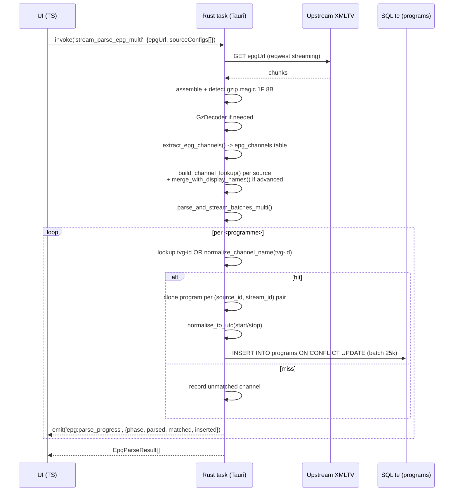
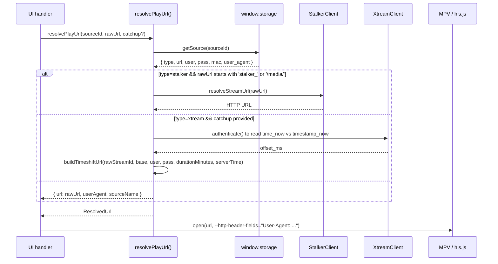

License: AGPL — pattern-only extraction. No source copying. See docs/reference-apps/LICENSE_ATTRIBUTION.md.

# 09 - ynotv EPG Ingestion + Stream Dispatch - Pattern Extraction

Generated: 2026-05-20
Upstream: `G:\Github\IPTV-Apps\ynotv\` (commit unknown, pnpm workspace, Tauri 2 desktop player)

## License and attribution

ynotv ships under **GNU AGPL-3.0**. AGPL is stricter than GPL (network-exposed derivatives must publish their source). HermesTV's reference-app boundary (`docs/48_REFERENCE_APPS_E2E_ADOPTION_CONTRACT.md`) treats AGPL as pattern-only — no source pasted, every adopted function rewritten clean-room with an inline attribution like `// Pattern adopted from ynotv (AGPL-3.0) - PATTERN-ONLY adoption, see docs/48.`. Quoted identifier strings (`bet.us`, `xmltv.php`) are XMLTV / Xtream protocol vocabulary, not operator data.

## Inventory (what exists in ynotv)

| Concern | Path (relative to ynotv root) | Surface |
| --- | --- | --- |
| Streaming XMLTV parser (chunked, gzip-aware) | `packages/app/src-tauri/src/epg_streaming.rs` | Rust, ~1850 lines |
| TS bridge to the parser (Tauri `invoke`) | `packages/ui/src/services/epg-streaming.ts` | progress events |
| Per-channel overrides + fuzzy match | `packages/ui/src/services/epg-overrides.ts` | SQLite, timeshift in SQL |
| Static regex XMLTV parser (small files) | `packages/local-adapter/src/xmltv-parser.ts` | TS, no streaming |
| Live URL resolver (Stalker/Xtream/M3U) | `packages/ui/src/services/stream-resolver.ts` | runs before MPV |
| DVR URL resolver (schedule-driven) | `packages/app/src-tauri/src/dvr/stream_resolver.rs` | persisted DVR |
| LICENSE | `LICENSE` | AGPL v3 |

ynotv has no `packages/core/src/services/epg/` — EPG lives in the Rust `src-tauri` crate (parser) and the UI `services/` folder (bridge + overrides). The `core` package is types-only.

## Architecture in one paragraph

ynotv treats XMLTV ingest as a **stream-and-pipeline** problem. Rust downloads chunks while a tokio task parses programmes already in memory and a third inserter task writes batches of 25 000 rows to SQLite. The download fans out (`stream_parse_epg_multi`) — each source receives only programmes whose `tvg-id` is in its mapping. Channel matching is layered: tvg-id, then M3U name, then a normalised fuzzy form (strips superscripts, "prime:", "ss:", "##"). Per-channel overrides live in SQLite; timeshift composes in the SQL view, not at insert time. Stream dispatch is decoupled: `resolvePlayUrl()` fans out per source-type — Stalker through `StalkerClient.resolveStreamUrl()`, Xtream catchup rebuilt with a server-clock offset from `time_now` vs `timestamp_now`, M3U/Xtream-live passes through.

## EPG sequence: how a programme becomes a row tied to a stream

Key observations:

1. **`source_id` is keyed at the programme row.** The same XMLTV channel `bet.us` can produce programme rows under multiple `source_id`s. Inserts use `ON CONFLICT(id) DO UPDATE` with `id = stream_id || '_' || start`, so later sources refresh titles without duplicating rows.
2. **Backpressure** lives in the `tokio::sync::mpsc` channel (`CHANNEL_BUFFER = 4` batches in flight). If the inserter falls behind, the parser stalls — no unbounded queue grows.
3. **DB-lock retries** are exponential (5 attempts, 100ms steps). DaveTV has no equivalent because it does not write EPG to disk.

## Channel-to-stream binding: the `channel_lookup` HashMap

ynotv builds one canonical map per source before parsing:

| Key form | Source | Purpose |
| --- | --- | --- |
| Raw `tvg-id` (e.g. `bet.us`) | `ChannelMapping.epg_channel_id` | Primary, O(1) |
| M3U display name (e.g. `US: BET HD`) | `ChannelMapping.channel_name` | Fallback when M3U omits tvg-id |
| Normalised name | `normalize_channel_name()` | Last-resort fuzzy |
| Display-name -> tvg-id (advanced) | `build_display_name_mapping()` | Bridges label-only M3U to XMLTV ids |

The value is `Vec<String>`, not a single string — this is how **primary + backup channels share one tvg-id**. Cost: each matched programme is cloned per stream_id (DaveTV's waterfall merges at read-time instead).

## Override + timeshift composition (the SQL trick)

The override layer is where ynotv earns its keep for end-users:

- `epg_channel_overrides(stream_id, epg_channel_id, timeshift_hours, logo_url)` — per stream
- `epg_program_overrides(id, stream_id, title, description, start, end, is_deleted, is_custom)` — per programme, supports tombstones
- `sourcesMeta(source_id, epg_timeshift_hours)` — per source

The editor `SELECT` (in `getEditorProgramsForStream`) composes both shifts in one `strftime()`: when the sum is 0 it returns `p.start` raw to preserve the `Z` suffix; otherwise it applies the sum in minutes via `strftime` modifier syntax. Time shifts are **never persisted** — applied at read time. Toggling a 4-hour shift on Sky+1 is instant, no re-sync. DaveTV has no override layer; tvg-ids come straight from the M3U.

## Fuzzy-match policy: ynotv vs DaveTV

| Behavior | ynotv (`epg-overrides.ts`) | DaveTV (`epgWaterfall.js`) |
| --- | --- | --- |
| Scoring | Sørensen-Dice + 0.2 substring bonus | Exact normalised-key equality |
| Noise tokens | Broad: quality + `us, uk, ca, channel, tv, the` | Quality-only |
| Ambiguity | Returns candidate list, UI confirms | Returns `""`, refuses to guess |
| Where used | "Fix mapping" search UI | Silent auto-resolve at request time |

Both are valid. DaveTV's ambiguity-rejection is **stronger** and should stay that way given it runs silently.

## Stream dispatch: the per-source-type fan-out

DaveTV has no equivalent fan-out — `routes/play.js` returns a single ticket-bound URL and relies on `/api/play/:ticket/sources` for fallback. No Stalker token resolution; no Xtream server-time offset; catchup URLs are built from local clock only.

## Cross-reference: DaveTV vs ynotv

| Capability | DaveTV | ynotv | Verdict |
| --- | --- | --- | --- |
| EPG URL waterfall | `epgWaterfall.buildEpgUrlsFromEntry` | Implicit in `SourceEpgConfig[]` order | DaveTV cleaner |
| Cross-source merge | `mergeProgrammeMaps` (first wins) | Per-source `ON CONFLICT UPDATE` | Equivalent |
| Gzip detection | magic + ext + CT + CD | magic + ext + Content-Encoding | DaveTV thorough |
| Streaming XML parse | No (full-body `fast-xml-parser`) | Yes (chunked + pipelined) | **GAP** |
| Mapping persistence | No (per-request catalog scan) | Yes (`channels` + `epg_channels` tables) | **GAP** |
| Per-channel timeshift | No | Yes, composed in SQL view | **GAP** |
| Tombstoned / custom programmes | No | Yes | Not blocking |
| Stalker token re-resolution | No | Yes | Out of scope today |
| Xtream catchup server-clock offset | No (local clock only) | Yes (`time_now` vs `timestamp_now`) | **GAP** |
| Live parse-progress events | No | Yes (`emit('epg:parse_progress')`) | Optional UX win |

## Top 3 EPG-streaming gaps in DaveTV's pipeline

1. **No streaming XMLTV parser.** `integrations/xmltv.js` fetches the entire body (10s timeout), buffers it, then hands it to `fast-xml-parser`. Large operator XMLTVs (50-200 MB) blow past the timeout on slow links and pin the Node event loop during parse. ynotv's pattern — `quick_xml` reader feeding an `mpsc::channel` to a batched inserter — is the production-grade fix. A clean-room Node port would use `sax-stream` or `node-expat` + a back-pressured queue.
2. **No persisted channel-to-programme storage.** DaveTV re-fetches and re-parses XMLTV on every cache miss (5-minute TTL) and re-runs `buildPlayableEpgIndex` on every `/api/epg/grid` request against the *current* catalog — `O(programmes x catalog_items)` per request. ynotv persists `programs(stream_id, source_id, start, end, ...)` and lets SQLite do the time-window query in microseconds. A first step would be a JSON-on-disk programme cache keyed by `tvg_id`, even before adopting SQLite.
3. **No Xtream catchup server-clock offset.** DaveTV's catchup endpoint will compute timeshift URLs from `Date.now()` against `start_utc`. Xtream panels report their own clock via `server_info.time_now` / `server_info.timestamp_now`; ynotv reads both and computes `offsetMs` before building the URL. Without that offset, catchup drifts by 1-4 hours on misconfigured panels. Fix is one `authenticate()` call cached per source — correctness payoff is large.

## Proposals (not commitments — must ride the provider-live truth gate)

- **P1:** `lib/epgStreamingParser.js` clean-room re-write using `sax-stream` + 5 000-row batch queue, gated by `EPG_STREAMING=1`. Output drops into `cache/epg/<source_id>.jsonl`; the in-memory cache stays as the fast path.
- **P2:** `programs` JSONL cache keyed by `(tvg_id, start_utc)` with a Node B-tree (`@js-sdsl/ordered-map`) for window queries — replaces the scan loop in `epgGrid.js`.
- **P3:** Keep DaveTV's stricter `findBestEpgChannelByName` ambiguity-rejection rule. Do **not** adopt ynotv's "return all candidates" pattern at request time (only acceptable in an explicit "Fix mapping" UI flow).
