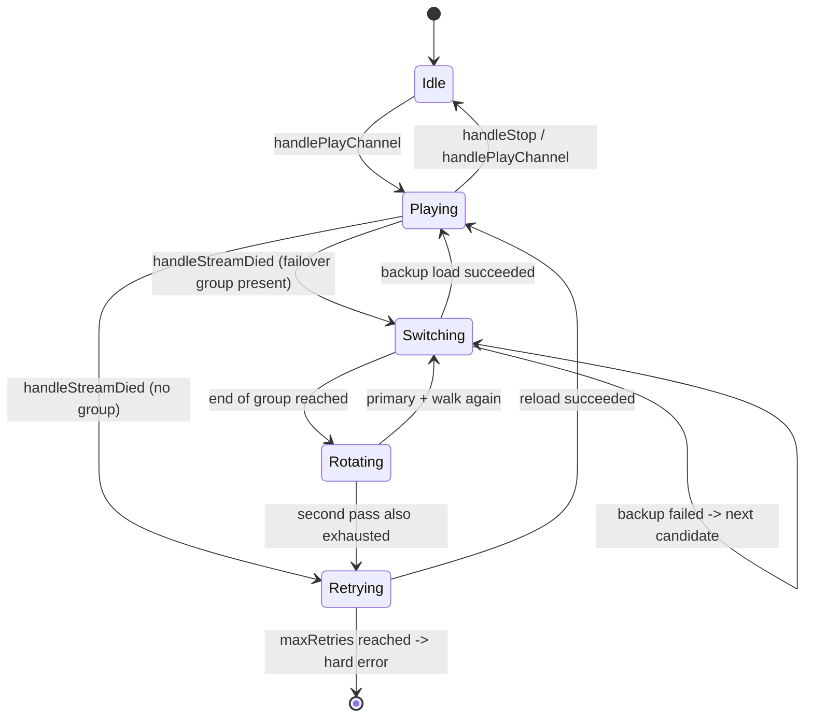
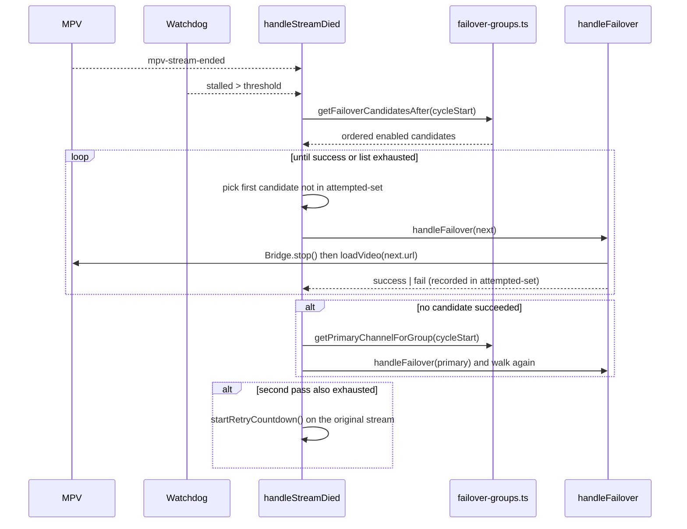

# 10 — ynotv Failover Behavior (Reference Extract)

License: AGPL — pattern-only extraction. No source copying. See docs/reference-apps/LICENSE_ATTRIBUTION.md.

## Scope

ynotv (AGPL, Tauri + React desktop player at `G:\Github\IPTV-Apps\ynotv`) implements an explicit **per-channel failover group** model: the operator pre-configures an ordered list of channel variants ("ESPN", "ESPN Backup-A", …) and the player walks that list when the active stream dies. This document captures the architecture, not a fork.

Key files inspected (architecture only, no paste):

- `packages/ui/src/services/failover-groups.ts` — group CRUD + lookup
- `packages/ui/src/hooks/usePlayback.ts` — failover loop + watchdog
- `packages/ui/src/components/FailoverGroupManager.tsx` — operator UI
- `packages/ui/src/components/FailoverOverlay.tsx` — switching overlay

ynotv has no `packages/core/src/services/` tree — failover lives entirely in the UI package alongside the Dexie/SQLite store.

## Data model

```
FailoverGroup
  group_id    string (uuid)
  name        string
  created_at  number (epoch ms)

FailoverGroupMember
  group_id    -> FailoverGroup.group_id
  stream_id   -> StoredChannel.stream_id  (unique — a channel is in ≤ 1 group)
  priority    integer 0..N  (0 = primary, monotonically increasing)
```

Two invariants the service enforces:

1. **A channel cannot belong to two groups.** `addChannelToFailoverGroup` reads any existing membership and throws if the new group differs.
2. **Priorities are renormalized to a dense 0..N-1 range** after every removal and reorder. No gaps. The current playing channel is always identified by its `priority` index relative to its siblings.

CRUD ops exposed: `createFailoverGroup`, `addChannelToFailoverGroup`, `removeChannelFromFailoverGroup`, `reorderFailoverGroupMember`, `reorderFailoverGroupChannels`, `renameFailoverGroup`, `deleteFailoverGroup`, plus reader helpers `getFailoverGroupMembers`, `getNextFailoverChannel`, `getFailoverCandidatesAfter`, `getPrimaryChannelForGroup`, `getFailoverGroupForChannel`, `listFailoverGroups`.

## Runtime state machine

`usePlayback` maintains a small bundle of refs used by the failover loop:

| Ref                                  | Purpose |
|--------------------------------------|---------|
| `failoverActiveRef`                  | We are mid-cycle (a backup is currently playing). |
| `failoverSwitchingRef`               | A switch is in flight — gate reentrancy. |
| `failoverCycleStartStreamIdRef`      | Stream that started the current cycle (used to walk the group). |
| `failoverCursorStreamIdRef`          | Most recently attempted candidate. |
| `failoverAttemptedStreamIdsRef`      | Set of stream IDs tried this cycle — prevents getting stuck on a single bad backup. |
| `failoverAttemptRef`                 | Attempt counter shown in the overlay. |
| `failoverFailedDuringSwitchRef`      | Defers a "stream died" signal that fires mid-load. |
| `recoveryArmedRef`                   | Don't react to a stream-death signal until at least one playback-progress sample has been seen. |
| `maxRetriesRef` / `stallThresholdMsRef` | Persisted operator settings (`streamMaxRetries`, `streamWatchdogSeconds`), live-updated via custom event. |



## Failure detection paths

Three independent signals route into a single `handleStreamDied()` choke point:

1. **MPV events** — `mpv-stream-ended`, `mpv-end-file-error`, `mpv-http-error`, `mpv-error` (Tauri event bus).
2. **Watchdog** — runs every 1 s for live TV. Samples `time-pos`, `paused-for-cache`, `cache-buffering-state`, `demuxer-cache-state` (`cache-end`/`reader-pts`/`fw-bytes`), `eof-reached`, `core-idle`, `idle-active`. Declares the stream dead when `eof-reached`, or `(core-idle|idle-active) && !madeProgress`, or buffer starved (cache <1.5 s and not growing) past `MIN_BUFFER_STARVATION_MS` (3.5 s, capped at `stallThreshold/2`), or no position/cache advance for `stallThresholdMs` (operator-set, default 10 s).
3. **Load failures** — `tryLoadWithFallbacks` tries the resolved URL, then extension-swapped fallbacks (`.ts → .m3u8 → .m3u` for live; `.m3u8 → .ts` for VOD). These intra-source fallbacks fire before any cross-source group walk.

`handleStreamDied` short-circuits when the player is intentionally stopped, user-paused, mid-retry, or before playback has been confirmed (`recoveryArmedRef`).

## The walk



Important properties of the walk:

- **Candidates are filtered by `enabled !== false`** at read time — the operator can mark a backup disabled without removing it from the group.
- **Two-pass circular rotation.** Once the tail of the group is exhausted, the loop re-anchors on the group's primary (priority=0) and walks again. This means a transient outage on the primary does not strand the player on a permanent backup.
- **Per-cycle attempted-set.** Failed backups are added; the loop never retries them inside the same cycle. The set is cleared on the second pass after rotation.
- **Sequential, not concurrent.** Each candidate is attempted only after the previous one's load resolves. No racing/Promise.race pattern.
- **Brief 800 ms UI hold** so the `FailoverOverlay` ("Switching to backup stream → channel name, Backup #N") is actually visible to the viewer.
- **Final fallback is the retry path.** After the rotation pass, control flows into the same `startRetryCountdown` used for non-grouped channels — exponential countdown 1→5 s, capped at `maxRetries` (default 20), then a hard "Stream unavailable" error.

## What this is *not*

- Not health-aware ranking — order is purely operator-defined `priority`. ynotv has no notion of provider-health-based reordering.
- Not multi-source-per-channel inside one logical entity — each "backup" is a **distinct StoredChannel**. Failover groups are essentially an ordered alias list pointing at separate channels (often from different providers).
- Not server-side — failover lives entirely in the player. The catalog/M3U source has no concept of grouping.

## Cross-reference with DaveTV (HermesTV)

DaveTV files inspected:

- `services/hermes-tv-api/src/lib/catalogMerge.js` — server-side cross-provider dedupe by normalized title; emits `sources[]` ordered by `PROVIDER_PRIORITY` (`xtremehd > apollo_group > iptv-org > jellyfin > seed`) with `UNHEALTHY_PROVIDER_PENALTY` demotion via `lib/streamProbe`.
- `services/hermes-tv-api/src/routes/play.js` — `_buildSourcesForItem` produces the ordered candidate list; `_streamHandler` implements `_tryNext(i)` walking sequentially with `?source_index=N` pin support, recording outcomes via `streamProbe.recordProviderOutcome` and emitting a friendly 503 with a `failures[]` and `providers_attempted[]` array if all sources fail.
- `services/hermes-tv-api/src/lib/providerRegistry.js` — canonical provider list.
- `services/hermes-tv-api/src/lib/streamProbe.js` — rolling provider-health window feeds health-aware demotion.

DaveTV already has the **right server-side primitive** that ynotv lacks: cross-provider title-merge + a sources[] list with auto-fallback in `/api/play/:ticket/stream`. ynotv's contribution is the **operator-curated override list** and a **client-side death detector** with redundant signals.

### Top 3 failover gaps in DaveTV

1. **No persistent client-side death watchdog.** `/api/play/:ticket/stream` does try sources in order when the *first* HTTP attempt fails server-side, but once a 302 has been issued and the player is streaming, a downstream HLS stall or CDN hiccup is invisible to the API. There is no equivalent of ynotv's `usePlayback` watchdog that polls position/cache-end/forward-bytes and triggers a re-resolve when growth stops. After a 302 lands the only recovery path is the user manually clicking play again — which mints a fresh ticket but starts from `index=0` again with no memory of what just failed.
2. **No operator-curated channel-level failover overrides.** `catalogMerge` collapses providers by normalized title (`espn.us` + `espn` + `ESPN HD` → one group), which works for the common "same channel, different provider" case. It does **not** let the operator say "for ESPN, try our paid backup feed at https://… before falling to iptv-org", and it has no UI to add a non-matching channel ("UK ESPN") as a backup for ("US ESPN"). ynotv's `FailoverGroup` model is exactly this missing override layer. DaveTV needs a complement to title-merge: an explicit per-channel ordered alias list stored alongside the merged catalog, queried after auto-merge.
3. **No re-attempt memory across the ticket session.** ynotv's `failoverAttemptedStreamIdsRef` set prevents the player from cycling through a known-dead backup repeatedly inside one cycle, with a clean reset on rotation. DaveTV's `/api/play/:ticket/stream` records `current_source_index` on success but does **not** persist a per-ticket "tried-and-failed" set across multiple stream-endpoint hits — every fresh GET starts from index 0 again, so a transient failure on source[0] gets re-tried instead of the player remembering it was just dead 30 s ago. (`source_index=N` query pin is the manual workaround; the automatic-memory version is missing.)

### Recommended design pulls (no AGPL code, pattern only)

- Add an operator UI table for `failover_overrides` keyed on a "canonical channel" (merged-catalog id) with an ordered list of either (a) other merged-catalog ids or (b) direct provider+item_id pairs. Apply this list *before* the title-merge candidates inside `_buildSourcesForItem`.
- Add a position/buffer watchdog in the React player surface (Web TV + Tizen shells). Wire it to a `POST /api/play/:ticket/next-source` endpoint that increments `current_source_index` server-side, records the failure via `streamProbe.recordProviderOutcome`, then 302s to the next resolved URL. Use the existing `failures[]` envelope on the 503 response.
- Make `current_source_index` and an `attempted_indices` set sticky on the ticket so HEAD/GET retries inside the 5-minute TTL do not loop on already-dead sources.

## License risk

None for this document — it describes patterns and identifier names. No code above the 5-line cap is reproduced. ynotv's AGPL still applies to its own tree; nothing here is incorporated into DaveTV at the file level.
