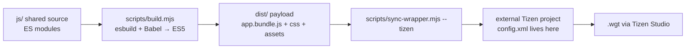
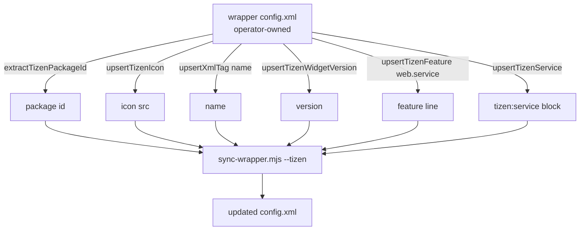

License: NuvioWeb upstream license unstated — pattern extraction only, no source copying. Treat as restrictive until upstream clarifies. See docs/reference-apps/LICENSE_ATTRIBUTION.md.

# 12 — NuvioWeb Tizen Wrapper Pattern

Extraction of NuvioWeb's "shared web app + thin Tizen wrapper" approach (Samsung Tizen 6.5 / Chrome 76 target) and a cross-reference with DaveTV's current Tizen packaging (`apps/hermes-tv-tizen-native/` + `apps/hermes-tv-tizen/` + `apps/hermes-web-tv/` web shell).

NuvioWeb keeps **zero `config.xml` and zero `.tproject` in its own repo** — those live in *separate wrapper repositories* (`NuvioMedia/NuvioTVTizen`, `NuvioMedia/NuvioWebOS`). The build pipeline syncs a `dist/` payload into an externally-maintained Tizen project skeleton, then the operator signs and packages with Tizen Studio. This decouples the platform-specific signing assets from the cross-platform JS source — a pattern DaveTV partially mirrors.

---

## NuvioWeb architecture overview

Key observations:

- **Single ES2015 source**, compiled twice: esbuild for tree-shake + bundle, Babel `@babel/preset-env` targeting `chrome 38`, then a second esbuild pass to flatten Babel helpers and disable arrow / const-let / template-literal output. Final IIFE bundle targets `es5` literally — safer than relying on a single transpile pass.
- **Bootstrap is staged.** A small `main.js` injected by sync owns Tizen-only concerns (key registration, env loading, optional companion-service launch); it then loads `app.bundle.js`. Platform-agnostic code never touches `tizen.*` directly — it goes through a `tizenAdapter` that capability-probes `window.webapis` and `window.tizen` and degrades silently in dev.
- **Hosted-app override.** A `__NUVIO_TIZEN_ENV_URL__` global lets the wrapper fetch its env JSON from a remote origin at boot, so operators can repoint API endpoints without re-signing the `.wgt`.
- **Optional companion Tizen service** (`com.nuvio.tizen.service`) is a sibling `tizen:service` declared in `config.xml`. The wrapper launches it via `tizen.application.launch(packageId + '.NuvioMediaService')`. Useful for background fetch / DRM workflows beyond the UI privilege set.
- **Key registration is minimal and capability-probed.** Only media keys are registered (`MediaPlay`, `MediaPause`, `MediaPlayPause`, `MediaFastForward`, `MediaRewind`). The adapter prefers `registerKeyBatch` and falls back to per-key registration when batch is missing. D-pad / Back come for free.
- **Back-key normalization** dedupes Back across remote firmwares: keyCodes `461`, `10009`, `27` (Escape), `8` (Backspace) all collapse to one `isBack` predicate. A `keyName === 'back'` lowercase fallback catches odd remotes.
- **HLS playback is layered**: native `<video>` first, hls.js MSE second, dash.js third, AVPlay last. Order is configurable through `__NUVIO_ENV__.PREFERRED_PLAYBACK_ORDER`. The `tizenAvplay` engine in NuvioWeb today is a *capability stub* — it advertises support and returns the webapis handle, but the heavy lifting is delegated to the native-video / hls.js path.
- **`viewmodes="maximized"` and `tizen:profile name="tv"` are operator-set in the external wrapper**, not in the repo. The sync script's `upsertTizenFeature` / `upsertTizenService` helpers patch the `<widget>` non-destructively — preserving operator-added `<access>` / privilege lines.

### Tizen config.xml patterns the sync script upserts

The sync script never writes signing certs, privileges, or `<access>` origins — those are operator-managed in the external wrapper repo so the JS pipeline stays oblivious to per-deployment secrets.

---

## Cross-reference: DaveTV's Tizen surface today

DaveTV has **two competing Tizen projects** in-tree, plus the React web shell:

| Path | Purpose | Has `config.xml`? | Build target |
|---|---|---|---|
| `apps/hermes-tv-tizen-native/` | Classic ES5 native-Tizen project (legacy / pre-React) | yes (in-tree) | webpack → `dist/main.bundle.js` → `package-wgt.js` → `hermes-tv.wgt` |
| `apps/hermes-tv-tizen/` | "Bridge" project for the React shell on Tizen | `config.xml.example` only (gitignored real one) | (planned — wraps `hermes-web-tv` build output) |
| `apps/hermes-web-tv/` | React 18 / Vite web shell that runs in browser + as the Tizen payload | n/a (web) | Vite |

DaveTV is partway through migrating *away* from `hermes-tv-tizen-native` (the legacy native scaffold) and *toward* `hermes-tv-tizen` wrapping the `hermes-web-tv` Vite bundle. Both projects coexist today, which is the largest single divergence from NuvioWeb's clean separation.

### What DaveTV already does well

- **AVPlay state machine documented** in `apps/hermes-tv-tizen/AVPLAY_INTEGRATION.md` — covers NONE → IDLE → READY → PLAYING/PAUSED, the DRM caveat, token-bearing URL handling via `tizen.keymanager`, and a real fallback to hls.js. Far richer than NuvioWeb's stub engine.
- **Bridge hook `useAvplayStream`** (`apps/hermes-web-tv/src/hooks/useAvplayStream.js`) mirrors `useHlsStream`'s React state shape so `PlayerModal` swaps engines transparently. Cached capability probe, ES5-safe, teardown idempotent.
- **Tizen lifecycle module** (`apps/hermes-tv-tizen/src/platform/tizenLifecycle.js`) handles `visibilitychange` → detach `<video>` srcObject + revoke audio blob URLs so Tizen's renderer eviction doesn't leak decoder slots. Includes first-user-gesture gate for Azure TTS autoplay.
- **Canonical key map** (`apps/hermes-web-tv/src/utils/tizenKeyMap.js`) — comprehensive code→name table, route-kind dispatcher, automatic `registerKeyBatch` with per-key fallback, ES5-only.
- **CSP locked down** in `config.xml.example`: explicit `connect-src` allowlist of the VPS + Azure cognitive endpoints, `script-src 'self' 'unsafe-inline'` (intentional for Vite's inline init), no `unsafe-eval`. Better than NuvioWeb (whose `config.xml` is operator-owned and therefore not in-tree at all).
- **Tier-aware AVPlay tuning** in `avplayEngine.js`: QN-class gets `BITRATE_LIMIT=20000|BUFFER_SIZE=30` + HDR property; UN-class gets conservative `HLS_REBUFFER_PERCENTAGE=0`. Matches the QN-primary / UN-graceful-degradation rule.

### Top 3 Tizen-wrapping gaps in DaveTV

**Gap 1 — Two Tizen projects, no single sync pipeline.**
NuvioWeb has *one* command (`npm run sync:tizen -- /path/to/wrapper`) that takes a built `dist/` and patches an externally-maintained wrapper. DaveTV has:
- `apps/hermes-tv-tizen-native/scripts/package-wgt.js` — packages a pre-built `dist/main.bundle.js` plus an in-tree `config.xml` into `hermes-tv.wgt`. Self-contained native scaffold.
- `apps/hermes-tv-tizen/` — has `config.xml.example` and `AVPLAY_INTEGRATION.md` but no `package-wgt` script wired against `hermes-web-tv`'s Vite output.
- No `sync-wrapper`-style helper to take `apps/hermes-web-tv/dist/` and stage it into `apps/hermes-tv-tizen/`.
Result: shipping the React shell to Tizen today requires manual file copying. Need an analog of `sync-wrapper.mjs --tizen` that targets `apps/hermes-tv-tizen/`, including an `upsertTizen*` family of helpers that survive operator-side edits to `config.xml`.

**Gap 2 — No staged Tizen bootstrap (`main.js`) between `index.html` and the React bundle.**
NuvioWeb injects a small `main.js` that runs *before* the React/JS bundle and owns Tizen-only setup: ES5 polyfill backfills (`replaceAll`, `Object.fromEntries`, `window.Node`), key registration, env-file load, optional companion-service launch, then sequenced `loadScript` calls for the bundle. DaveTV's `apps/hermes-tv-tizen-native/index.html` loads `bundle.js` directly with no Tizen-only prelude, and `apps/hermes-web-tv/` is a Vite SPA whose `index.html` is shared between web and Tizen builds. The Tizen build therefore relies on the React bundle itself to find `window.tizen` (it does, via `tizenKeyMap.installTizenKeyHandler` and `tizenLifecycle.installTizenLifecycle`) — but key-registration ordering is racy and the polyfill set is implicit. Add a Tizen-only `main.js` (NuvioWeb pattern) that runs first, registers keys synchronously, applies polyfills, and only then triggers React boot. This also lets a hosted-env URL pattern (`__DAVETV_TIZEN_ENV_URL__`) repoint the VPS without re-signing.

**Gap 3 — Companion Tizen service not present.**
NuvioWeb declares a `<tizen:service id="<pkg>.NuvioMediaService" type="ui">` and launches it from the wrapper to handle background media tasks the UI privilege set can't reach. DaveTV's `config.xml` (both copies) declares only the UI app — no companion `tizen:service` block. This blocks any future need for: (a) background EPG prefetch that survives `background-support="disable"`, (b) local HTTP helper for AVPlay quirks (NuvioWeb keeps a `runtime/media-http` helper around), (c) DRM key-request callbacks that need a longer-lived process than the React UI. Companion service is optional today but is the natural next addition once VOD provider PlayReady support lands. The sync script's `upsertTizenService` helper is a directly-portable pattern.

#### Honorable mentions

- The two in-tree `config.xml`s disagree on access origins (`hermestv.local` LAN vs `tv.daveai.tech` VPS). Consolidating onto `hermes-tv-tizen/` as canonical prevents drift.
- Pin `browserslist: ["chrome 76"]` in `apps/hermes-web-tv/package.json` to match Tizen 6.5 webview. `hermes-tv-tizen-native/` already does; the shared shell does not.
- `wgt-inspect.sh` is referenced in `AVPLAY_INTEGRATION.md` but its existence at `tools/wgt-inspect.sh` is unverified. Borrow NuvioWeb's pattern of pre-sign CSP/privilege validation.

---

## Adoption recommendations (patterns only)

1. **Consolidate to one wrapper** — designate `apps/hermes-tv-tizen/` canonical; deprecate `hermes-tv-tizen-native/`.
2. **Build `tools/sync-tizen-wrapper.mjs`** taking `hermes-web-tv/dist/` → `hermes-tv-tizen/`. Port NuvioWeb's `upsertXmlTag` / `upsertTizenService` regex helpers so operator edits survive.
3. **Add `apps/hermes-tv-tizen/main.js`** (Tizen-only ES5 bootstrap) that runs before the Vite bundle: polyfills, `registerKeyBatch`, optional companion-service launch, then load `index.js`.
4. **Declare a placeholder `tizen:service`** in `config.xml.example` to future-proof for background EPG / DRM.
5. **Never write privileges or certs from JS** — sync script only patches in-tree-safe fields (name, version, icon, optional service block).

This preserves DaveTV's stronger AVPlay/lifecycle/key-map work while gaining NuvioWeb's clean "shared shell, thin wrapper, one sync command" packaging story.
