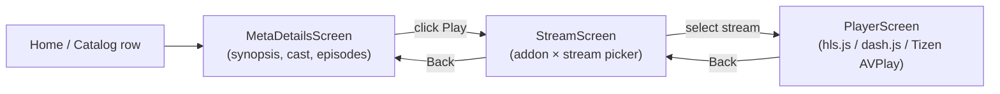
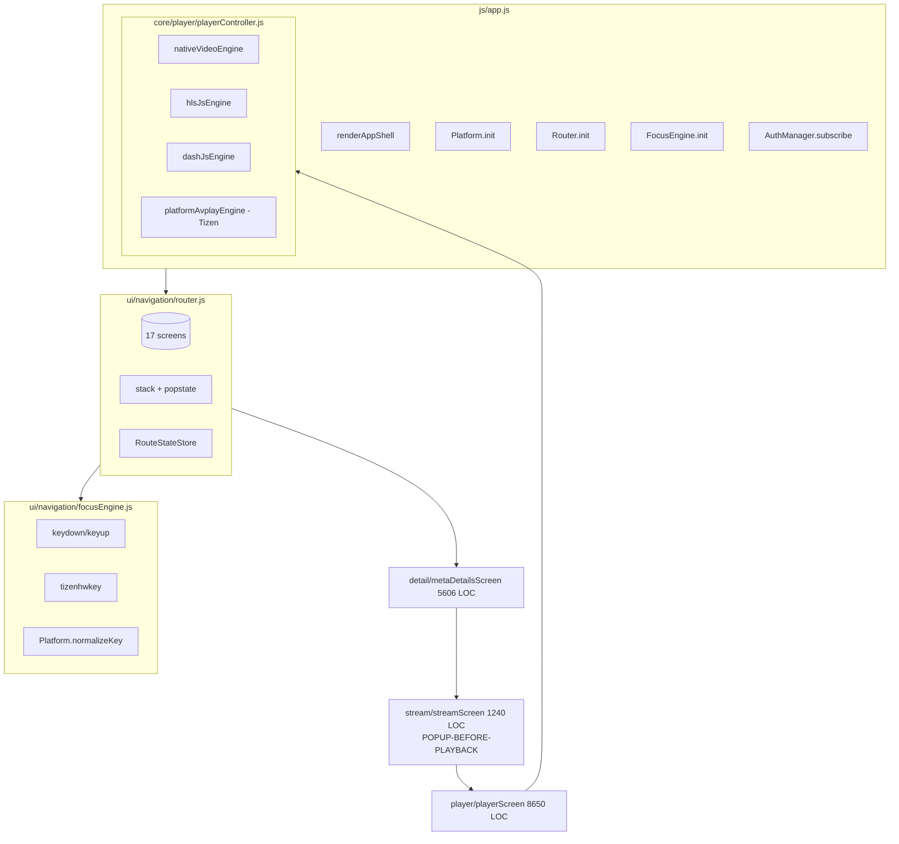

License: NuvioWeb upstream license unstated — pattern extraction only, no source copying. See docs/reference-apps/LICENSE_ATTRIBUTION.md.

# NuvioWeb Shared Web App — Cross-Reference vs DaveTV

NuvioTV Web (`G:\Github\IPTV-Apps\NuvioWeb`) is a BETA shared web app that doubles as a Tizen + webOS wrapper host. Plain JS (no React), ESM bundled by esbuild + Babel, explicitly targets the Stremio addon ecosystem. README ends with "choose and document the final license" — upstream **license is unstated**. Treat every observation as architectural pattern only.

Files audited (no source copied beyond <5-line idiom snippets): `index.html`, `js/app.js` (156 LOC), `js/ui/navigation/router.js` (286), `focusEngine.js` (123), `screen.js` (227), `js/platform/sharedKeys.js`, `js/platform/adapters/*`, `js/ui/screens/detail/metaDetailsScreen.js` (5606 — the monolith), `js/ui/screens/stream/streamScreen.js` (1240), `js/ui/screens/player/playerScreen.js` (8650), `js/core/storage/localStore.js`, `js/core/player/playerController.js`, `js/runtime/loadStreamingLibs.js`.

---

## 1 — Boot pipeline & entry points

`index.html` is dead-simple: four CSS link tags, a `nuvio.env.js` runtime config, vendor QR lib, then `app.bundle.js`. No `<div id="root">` — the bootstrap renders directly into `<body>`.

`js/app.js` orders the boot strictly:

```
renderAppShell() → Platform.init() → applyPerformanceMode() → I18n.init()
→ Router.init() → PlayerController.init() → FocusEngine.init()
→ ThemeManager.apply() → I18n.apply() → warmStreamingLibs(delayMs:1400)
→ AuthManager.subscribe(state ↦ Router.navigate(...)) → AuthManager.bootstrap()
```

Notable patterns:
- **`addonsRemote=1` URL switch** routes to `bootstrapAddonRemoteMode()` — a separate page for managing Stremio addons, bypassing the normal shell.
- **`performance-constrained` body class** flips on when `isWebOS() || isTizen() || hardwareConcurrency ≤ 4 || deviceMemory ≤ 2`; CSS disables heavy effects.
- **`warmStreamingLibs({ delayMs: 1400 })`** defers hls.js / dash.js fetch ~1.4 s after first paint so render isn't blocked.
- **Global `error` + `unhandledrejection` handlers** repaint the body with a fatal-error screen — never leaves the user on blank.

DaveTV mirror: `main.jsx` → `App.jsx` follows the same "render shell, then warm libs" rhythm, but React.lazy gives finer-grained chunk control than NuvioWeb's single bundle.

---

## 2 — Router (screen-based, not URL-based)

NuvioWeb does **not** use URL pathnames. It uses a hand-rolled `Router` with a hash-of-routes map (17 entries: `home | player | account | authQrSignIn | authSignIn | syncCode | profileSelection | detail | library | search | discover | settings | plugin | catalogOrder | stream | castDetail | catalogSeeAll`). Each route is a singleton "screen" object exposing `mount(params, ctx)`, `cleanup()`, `captureRouteState()`, `consumeBackRequest()`, and `onKeyDown(event)`.

Mechanics worth borrowing:
- **`NON_BACKSTACK_ROUTES`** (auth/profile-selection) never push history — back from `home` exits the app, not back to login.
- **`RouteStateStore`** keyed by `screen.getRouteStateKey(params)` lets a screen save/restore scroll position, focus index, filter state across navigations.
- **`window.popstate` is the back-button source of truth** on Tizen + webOS. NuvioWeb wraps it with `suppressPopstateUntil` + `ignoreSinglePopstate` flags so screens can swallow back-presses without firing browser-history back.
- **`consumeBackRequest()`** on the active screen runs first; returns `true` consumes the back, `false` rolls history.

DaveTV equivalent: App.jsx has no router — it's a single-page state machine driven by `patchState({ selectedItem, showPlayer, showSettings, … })`. The 14 shells (`shells/*.jsx` registered in `engine/layoutRegistry.js`) are interchangeable views over the **same** state, not separate routes. Loses NuvioWeb's per-route state-store + back-stack benefits.

---

## 3 — Focus engine + TV remote-control key handling

`FocusEngine.init()` binds three capture-phase listeners on `document`: `keydown` → `handleKey`, `keyup` → `handleKeyUp`, `tizenhwkey` (Tizen-only) → `handleTizenHardwareKey`. Each event is normalized via `Platform.normalizeKey()`, then checked against `Platform.isBackEvent()`. If Back, the active screen gets a 250 ms-debounced `consumeBackRequest()` chance before router back. Otherwise `screen.onKeyDown(normalizedEvent)` fires.

`sharedKeys.js` has two ideas worth lifting:
- **Rotated D-pad mapping** for simulators: when `LocalStore.get("rotatedDpadMapping")` is true (or UA contains `simulator`), arrows swap 37↔38 and 39↔40 so the Tizen sim's tilted layout becomes intuitive. Production TVs untouched.
- **`isEditableTarget()` short-circuit**: `Backspace`/`Delete` inside `INPUT`/`TEXTAREA`/`contentEditable` are NOT Back. Without this, typing in search would close the screen.

Back-event detection is comprehensive: keyCode 10009 (Tizen), keyName "Back" (webOS), Escape, Backspace, GoBack, XF86Back, code BrowserBack, plus any key whose name contains `back`. Color (Red 403, Green 404, Yellow 405, Blue 406), transport (Play 415, Pause 19, FF 417, RW 412), Info 457, Guide 10232, ChUp/Dn 427/428 are normalized too.

DaveTV match: `utils/tizenKeyMap.js` has the **same** codes (37-40, 13, 10009, 10182, 403-406, 415, 19, 417, 412, 457, 10232, 427/428, 447-449, 48-57) plus older Samsung alternates (4/5/6/7) and the `registerKey` boot dance. DaveTV's keymap coverage is broader.

**Where DaveTV is weaker:** no central FocusEngine equivalent. Each shell binds its own focus handler (`utils/tizenSpatialNav.js` exists, adoption varies). NuvioWeb's `ScreenUtils.moveFocusDirectional()` in `js/ui/navigation/screen.js` is a clean "score nearest candidate by primary-axis distance then aligned-axis tolerance, with strict-grid toggle" algorithm worth porting.

---

## 4 — Media-detail → stream-picker → player flow (CRITICAL: popup-before-playback antipattern)

NuvioWeb's click-to-play path is **three screens**, not one:



Confirmed call sites:
- `metaDetailsScreen.js:4284` → `Router.navigate("stream", { itemId, videoId, episodes, … })`
- `streamScreen.js:558` lists addon × quality rows; user must pick one
- `metaDetailsScreen.js:4348` / `:5512` → `Router.navigate("player", { streamUrl, … })` only after pick
- `playerScreen.js:2818` → can navigate back to stream picker mid-playback to switch source

This is exactly the popup-before-playback antipattern DaveTV's "no popups before playback" rule rejects. **DaveTV must not adopt the StreamScreen step.** Stremio-addons produce N candidate streams per title, so NuvioWeb has a structural reason for the picker — but it's still bad UX for IPTV channel surfing.

**DaveTV's existing behavior is correct:**
- `App.jsx:1080-1110` — `handleItemClick` checks `item.type === 'live'` and jumps **directly** to `handlePlay → _startPlayback`. Only VOD/series get the detail panel.
- `App.jsx:1147-1158` — when a live card is focused (not yet clicked), DaveTV pre-warms the PlayerModal lazy chunk and `hls.js` so click-to-first-byte is sub-second.
- VOD/series flow opens `MediaDetailPanel.jsx` with a synopsis + a single "Watch" button calling `onPlay(item, providerId)` directly — no stream picker. Provider is pre-chosen as `item.providers[0]`; auto-fallback runs server-side via `/api/play/:ticket/sources`.

DaveTV's closest analogue to StreamScreen is `SourceComparePanel.jsx` — but it's a non-blocking inline comparison inside the detail panel, not a gate the user must pass through.

---

## 5 — State management & persistence

NuvioWeb's storage layer is one file: `localStore.js` — five methods wrapping `localStorage` with `JSON.parse/stringify`. Every persisted preference (theme, locale, last profile, rotated-dpad, "hasSeenAuthQrOnFirstLaunch") goes through this single seam. No Redux, no Zustand, no bus — components read on mount, write on event.

Cross-screen state lives on: Router itself (`current`/`currentParams`/`stack`), `RouteStateStore` (in-memory keyed map), singleton screen objects (each screen IS its container), `AuthManager.subscribe` (observer for auth only).

DaveTV uses a `patchState()` reducer in `App.jsx` + module-level stores under `store/` (`profileStore`, `voicePrefStore`, `watchlistStore`, `playbackPositionStore`, `skipIntroPrefStore`, `onboardingState`). Functionally equivalent, split per-concern instead of one bag.

---

## 6 — Lazy loading & code splitting

NuvioWeb ships **one** `app.bundle.js`. The "lazy" mechanism is the runtime warmer `loadStreamingLibs.js` that fetches hls.js / dash.js via `<script>` injection 1.4 s after boot. Screen modules are statically imported at the top of `router.js` so the whole screen catalog is in the initial bundle.

DaveTV is **further along**: 16 modal components, all 14 shells, and `hls.js` are `React.lazy` chunks (`App.jsx:60-88`, `layoutRegistry.js:20-33`); `i18n` is a side-effect import for eager evaluation; `FloatingChatbot` + `OnboardingWizard` are eager (voice latency / first-paint gate); `Suspense fallback={null}` on the modal stack — no spinner for closed modals. **Gap inverted:** NuvioWeb has nothing to teach DaveTV here.

---

## 7 — Component diagram (NuvioWeb shared web app, top level)



---

## 8 — Top-3 web-app gaps in DaveTV vs NuvioWeb

1. **No central FocusEngine / spatial-nav util.** NuvioWeb's `ScreenUtils.moveFocusDirectional()` (`screen.js:63-195`) is a 130-line directional-focus algorithm with a `strictDpadGridNavigation` flag. DaveTV has the primitive in `utils/tizenSpatialNav.js` but no centralized scoring function — focus behavior drifts between shells. **Fix:** lift the algorithm (re-implemented from scratch) into a `useSpatialFocus()` hook used by every shell.

2. **No `RouteStateStore` equivalent — scroll/focus state lost when switching layouts.** Open Settings or EPG modal, close it, DaveTV's CatalogGrid scrolls to top because the shell remounts. NuvioWeb captures `{ scrollTop, focusIndex, addonFilter }` per route key and restores on return. **Fix:** add `store/routeStateStore.js` keyed by `layout|providerFilter|contentFilter`, capture `{ scrollTop, focusedItemId }` on unmount, restore on mount. Especially valuable for the EPG modal.

3. **No `consumeBackRequest()` contract between Back and active modal/shell.** DaveTV modals listen for Escape individually (`MediaDetailPanel.jsx:52-62`); no top-level dispatcher asks "does the active surface want to swallow Back?". On Tizen TVs the HW Back key is the primary nav, and a 250 ms debounce (NuvioWeb does this at `focusEngine.js:60-66`) prevents Samsung remote long-press double-fire. **Fix:** `useBackRequest(handler)` hook + App.jsx dispatcher that walks ordered list (modal → overlay → shell → close), 250 ms debounce.

**Antipattern to explicitly NOT adopt:** the StreamScreen popup. DaveTV's "live → direct play; VOD → detail panel with single Watch button" is correct. Stremio's N-streams-per-title is why NuvioWeb needs a picker — DaveTV's catalog merge + auto-fallback (Wave 13) makes it unnecessary, and the user has explicitly rejected popups before playback.

---

## Reference paths

- NuvioWeb root: `G:\Github\IPTV-Apps\NuvioWeb\`
- DaveTV web shell: `G:\Github\HermesTV-Tizen-AI\apps\hermes-web-tv\src\`
- DaveTV remote keymap: `apps/hermes-web-tv/src/utils/tizenKeyMap.js`
- DaveTV media detail: `apps/hermes-web-tv/src/components/MediaDetailPanel.jsx`
- DaveTV play handler: `apps/hermes-web-tv/src/App.jsx:1080-1195`
- DaveTV shell registry: `apps/hermes-web-tv/src/engine/layoutRegistry.js`
