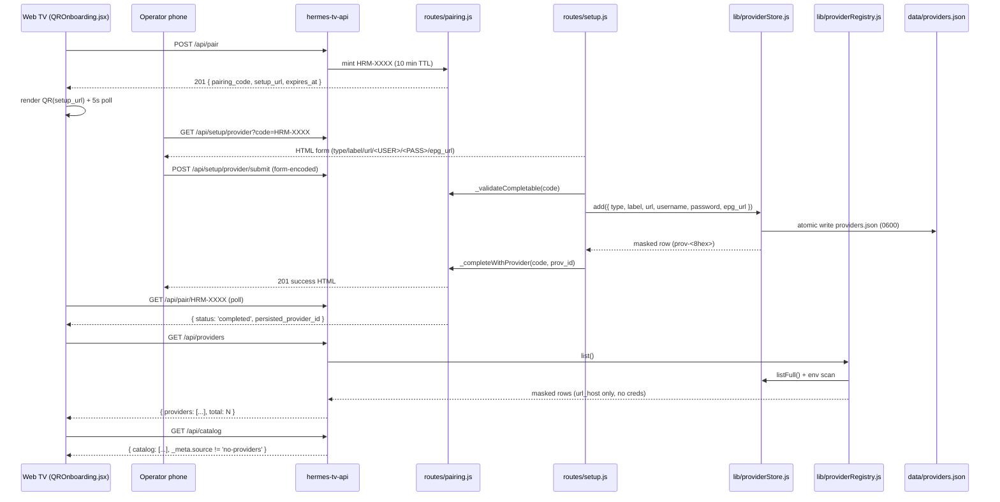
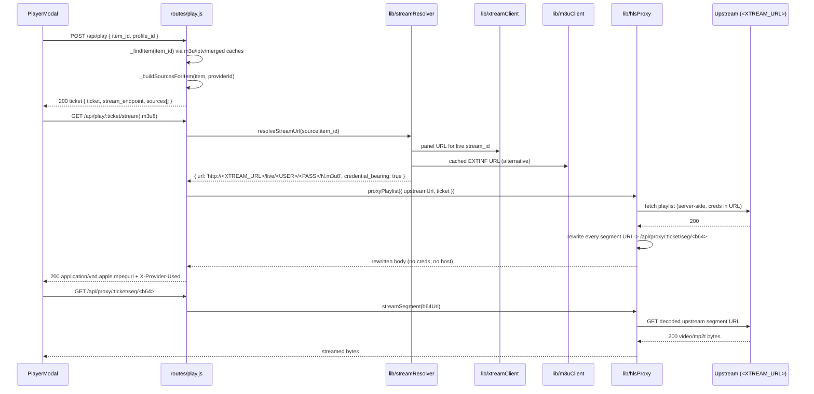
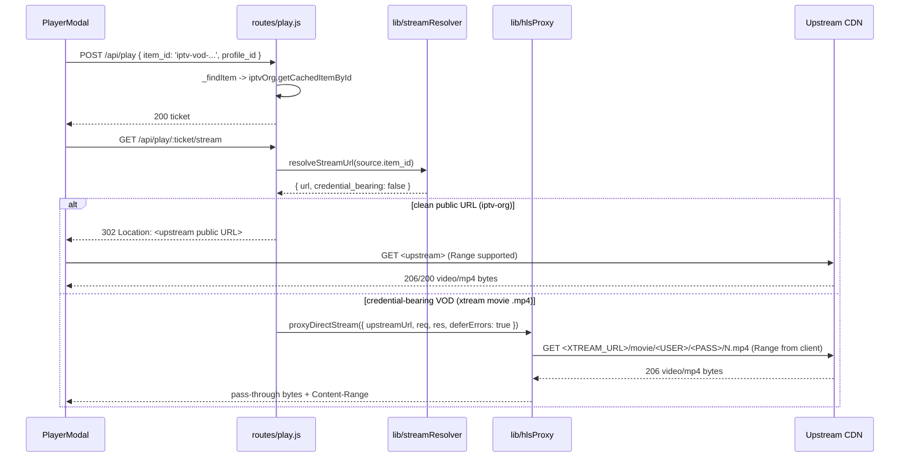
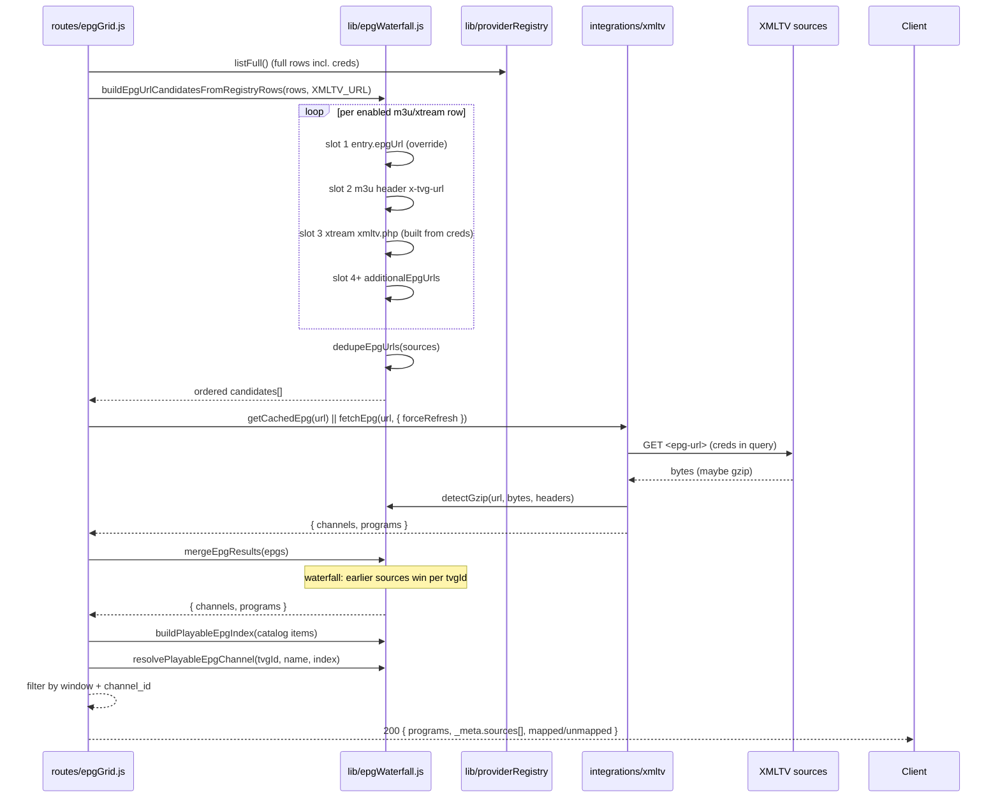
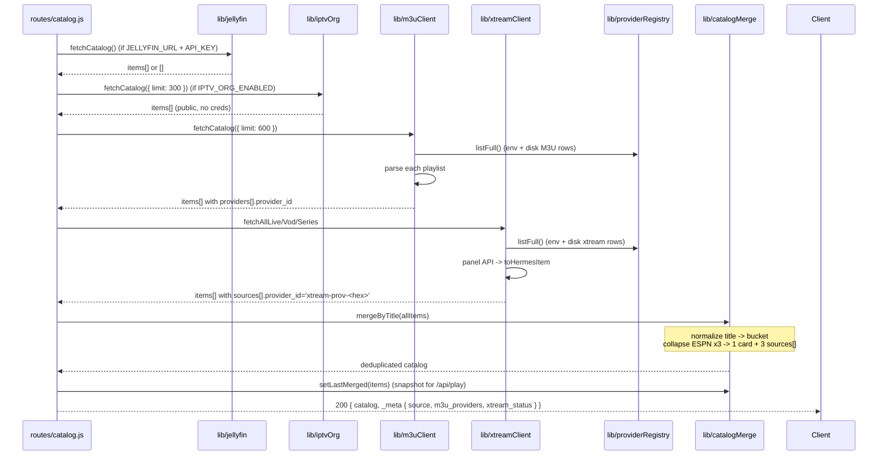
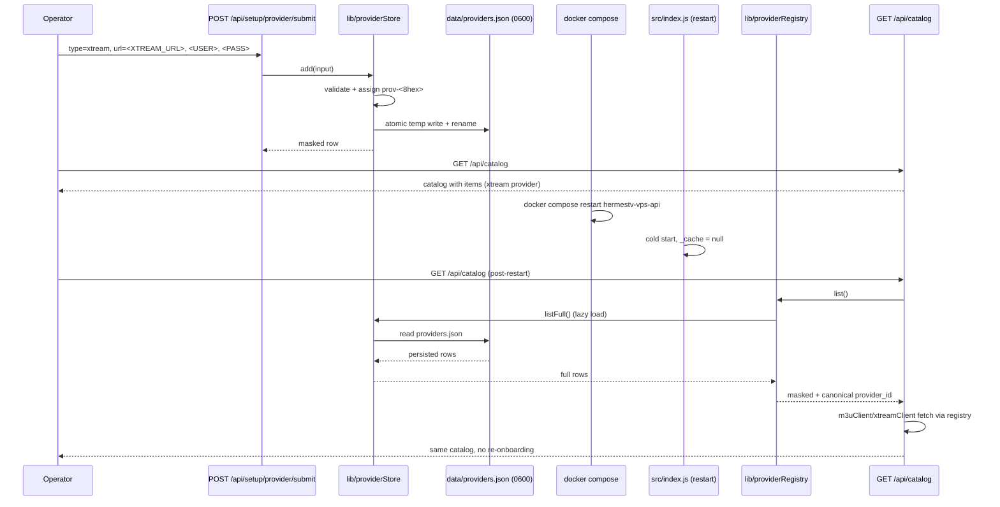
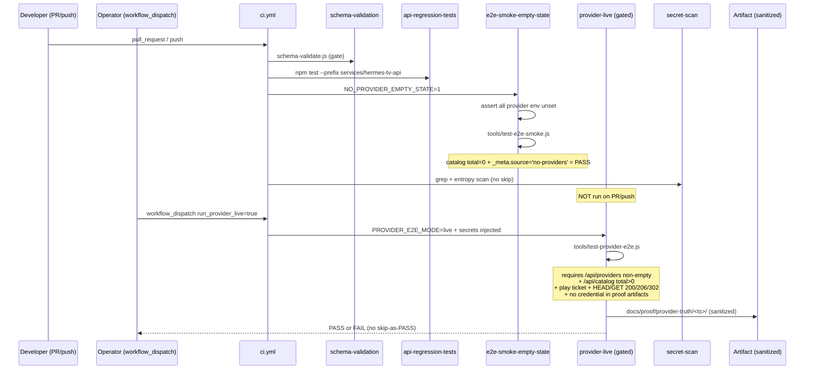
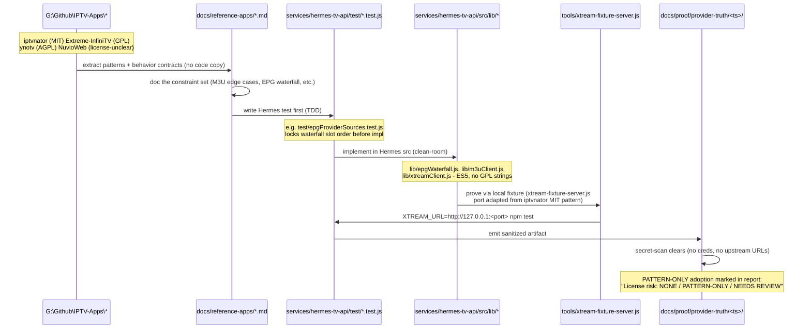

# DaveTV E2E Flow Diagrams

Generated: 2026-05-20

Eight mermaid `sequenceDiagram` blocks covering the critical end-to-end paths a
new engineer must understand. Source-of-truth contracts:
`docs/46_PROVIDER_TRUTH_PROOF_CONTRACT.md`,
`docs/47_REMAINING_E2E_COMPLETION_CONTRACT.md`,
`docs/48_REFERENCE_APPS_E2E_ADOPTION_CONTRACT.md`.

All credentials are masked (`<XTREAM_URL>`, `<USER>`, `<PASS>`, `<TOKEN>`).

---

## 1. Provider QR Onboarding to Visible Catalog

The TV mints a fresh pairing code via `POST /api/pair` (10-minute TTL,
in-memory) and renders the returned `setup_url` as a real scannable QR. The
operator's phone opens `/api/setup/provider?code=HRM-XXXX`, posts credentials,
and `routes/setup.js` calls `providerStore.add()` to atomically write
`data/providers.json`. On success it flips the pairing envelope to `completed`.
The TV's 5-second poll on `GET /api/pair/:code` sees the completion and
re-fetches `/api/providers` (masked through `providerRegistry.list()`) and
`/api/catalog`, which now returns real items. The pairing record is
short-lived; the provider config is durable.

---

## 2. Live TV Play - HLS Proxy - Stream Bytes

`POST /api/play` builds `sources[]` (priority-ordered, cross-provider) and
returns a ticket whose `stream_endpoint` carries an `.m3u8` suffix when the
primary source resolves to HLS so `hls.js` engages. On the subsequent
`GET /stream`, `streamResolver` produces an upstream URL flagged
`credential_bearing: true`. The route then calls `hlsProxy.proxyPlaylist` to
fetch the playlist server-side and rewrite every segment URI to
`/api/proxy/:ticket/seg/<b64>` (base64url of the absolute upstream URL).
The browser only ever sees opaque ticket-scoped paths; the upstream credentials
never enter the response headers, body, or Location. If the first source fails,
the route walks the next entry in `sources[]` and records the failure via
`streamProbe.recordProviderOutcome` until one wins or all are exhausted (503).

---

## 3. VOD Play - Direct or Proxied

VOD playback shares the ticket envelope with live TV. The branching logic lives
in `routes/play.js _streamHandler`: when `resolveStreamUrl` reports
`credential_bearing: false`, the route 302-redirects directly to the public CDN
(common for iptv-org). When the upstream is a credential-bearing direct byte
stream (Xtream Codes `.mp4` VOD), `hlsProxy.proxyDirectStream` pipes the bytes
through the API with Range header propagation so seek/scrub works. The client
never sees the upstream URL or credentials in either branch.

---

## 4. EPG Waterfall Ingestion

`routes/epgGrid.js` invokes `epgWaterfall.buildEpgUrlCandidatesFromRegistryRows`
to assemble an ordered EPG URL list per provider: explicit override -> M3U
header `x-tvg-url` -> Xtream `xmltv.php` default -> additional URLs, deduped.
`integrations/xmltv` fetches each candidate (honoring gzip via
`detectGzip` which checks magic bytes 0x1F 0x8B, `.gz` extension, content-type,
and content-disposition). `mergeEpgResults` waterfalls the parsed results so
the earliest source wins per `tvgId`. `buildPlayableEpgIndex` then maps XMLTV
channels to real catalog items by exact `tvg_id` first, then unique normalized
channel name (ambiguous matches return null - no silent guessing). The response
exposes per-source diagnostics via `_meta.sources[]` with no credentials.

---

## 5. Catalog Merge Across Providers

`resolveCatalog()` fans out to every configured upstream. Jellyfin owns the
base list when present; `iptvOrg`, `m3uClient`, and `xtreamClient` are merged
in additively. Both `m3uClient` and `xtreamClient` consult
`providerRegistry.listFull()` for env-derived AND disk-stored providers
(synthesizing `m3u-prov-<hex>` or `xtream-prov-<hex>` IDs for disk rows).
`catalogMerge.mergeByTitle` then collapses cross-provider duplicates
(normalized title bucket) into single items carrying a `sources[]` array
ordered by health, which `/api/play` later walks for auto-fallback.
The `X-Catalog-Source` response header reports `jellyfin`/`iptv-org`/
`providers`/`merged`/`no-providers`. There is no synthetic fallback list -
zero items returns honest empty per the no-mocks rule.

---

## 6. Restart-Survival Proof

`providerStore` persists every `add()` to `data/providers.json` via an atomic
temp-then-rename write on the API container's writable volume (mounted by
docker compose). The in-memory cache is rebuilt lazily on first read after
boot. After `docker compose restart`, the next `/api/catalog` call triggers
`providerRegistry.listFull()`, which loads the disk rows, and
`m3uClient`/`xtreamClient` both call `providerRegistry.listFull()` to discover
the same credentials they had before. No re-pairing required. The empty
pairing-code table (in-memory only) on the new boot is irrelevant - completed
provider configs are durable. This is the proof gate that distinguishes a real
registry from the previous in-memory-only setup that contract 46 calls out as
incomplete.

---

## 7. CI Proof Pipeline

CI splits empty-state from provider-live per contract 46/47. PR and push events
run `e2e-smoke-empty-state` with `NO_PROVIDER_EMPTY_STATE=1` and an explicit
assertion that every provider env var (`APOLLO_M3U_URL`, `XTREMEHD_M3U_URL`,
`XTREAM_URL/USERNAME/PASSWORD`, `JELLYFIN_URL/API_KEY`, `IPTV_ORG_ENABLED`) is
unset - the empty-state assertion would otherwise be nondeterministic. The
`provider-live` job is gated by
`github.event_name == 'workflow_dispatch' && inputs.run_provider_live == 'true'`
and consumes operator-configured GitHub Action secrets. It runs
`tools/test-provider-e2e.js` which fails when `/api/catalog` is empty or
playback skip is detected, then uploads sanitized artifacts to
`docs/proof/provider-truth/<ts>/`. A grep that requires `^=== Results: [1-9]
PASS, 0 FAIL` makes "skip counted as pass" impossible.

---

## 8. Reference Apps Adoption Flow

Contract 48 forbids bulk copying source from GPL/AGPL reference apps. The
adoption pattern is: read the reference behavior, write a markdown contract
under `docs/reference-apps/` describing the constraint, write a Hermes test
that locks that constraint, then implement clean-room in `services/hermes-tv-api/src/lib/`.
The Xtream fixture server (`tools/xtream-fixture-server.js`) is the
exception - it adapts iptvnator's MIT-licensed mock-server shape, attribution
preserved. The fixture proves the end-to-end pipeline without paid-provider
credentials so PR-time CI has a non-skipped happy path, while the
`provider-live` job remains the only gate that proves real upstream.
Every adopted pattern produces a Hermes test, a Hermes implementation, AND a
proof artifact, with the agent report citing
`License risk: NONE / PATTERN-ONLY / NEEDS REVIEW`.

---

## Ambiguities / Best-Guess Notes

- **Diagram 3 (VOD)**: the codebase does not yet expose a dedicated VOD route -
  `routes/play.js` handles VOD via the same ticket flow as live, branching
  inside `_streamHandler` on `resolved.credential_bearing`. The 302-vs-proxy
  split shown is the documented behavior; a Range-aware proxied VOD test is
  flagged in contract 48's `P1` list as not yet covered E2E.
- **Diagram 6 (restart)**: the docker volume mount that backs
  `data/providers.json` lives in `upstream/docker-vps/VPS_COMPOSE.yml` (not
  read here). The flow assumes the operator has wired that volume per
  `docs/42_VPS_DEPLOY_VIA_GH_ACTIONS.md`; without it the file is ephemeral.
- **Diagram 8 (adoption)**: the "doc the constraint" step writes to
  `docs/reference-apps/*.md`, but the exact lifecycle (who reviews license
  classification before TDD begins) is described in contract 48 only as the
  agent report template, not as an automated gate.
